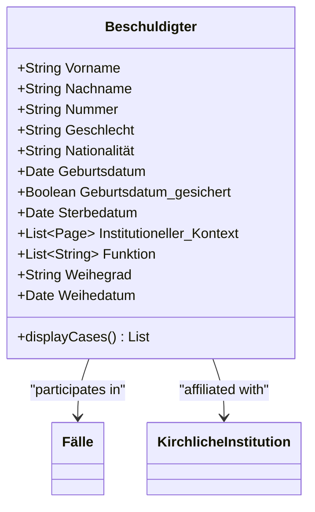
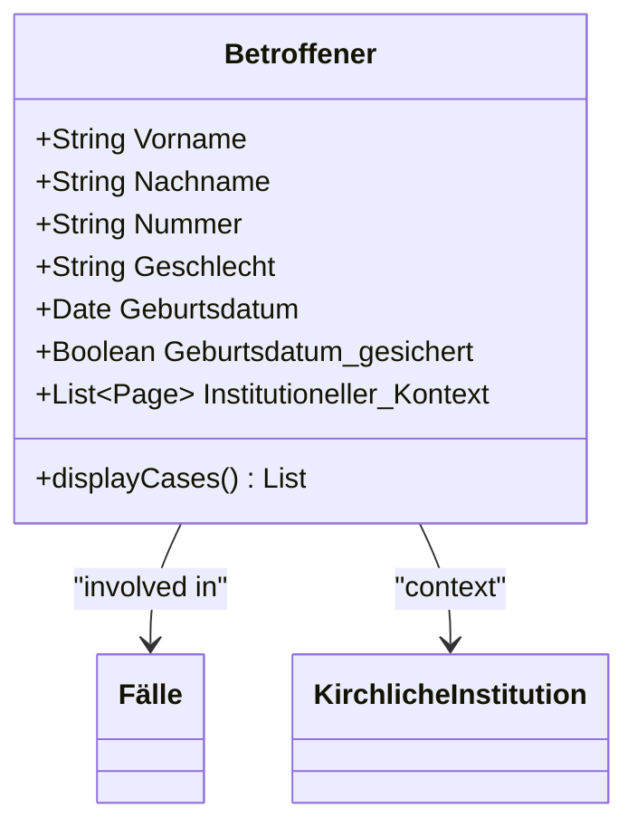
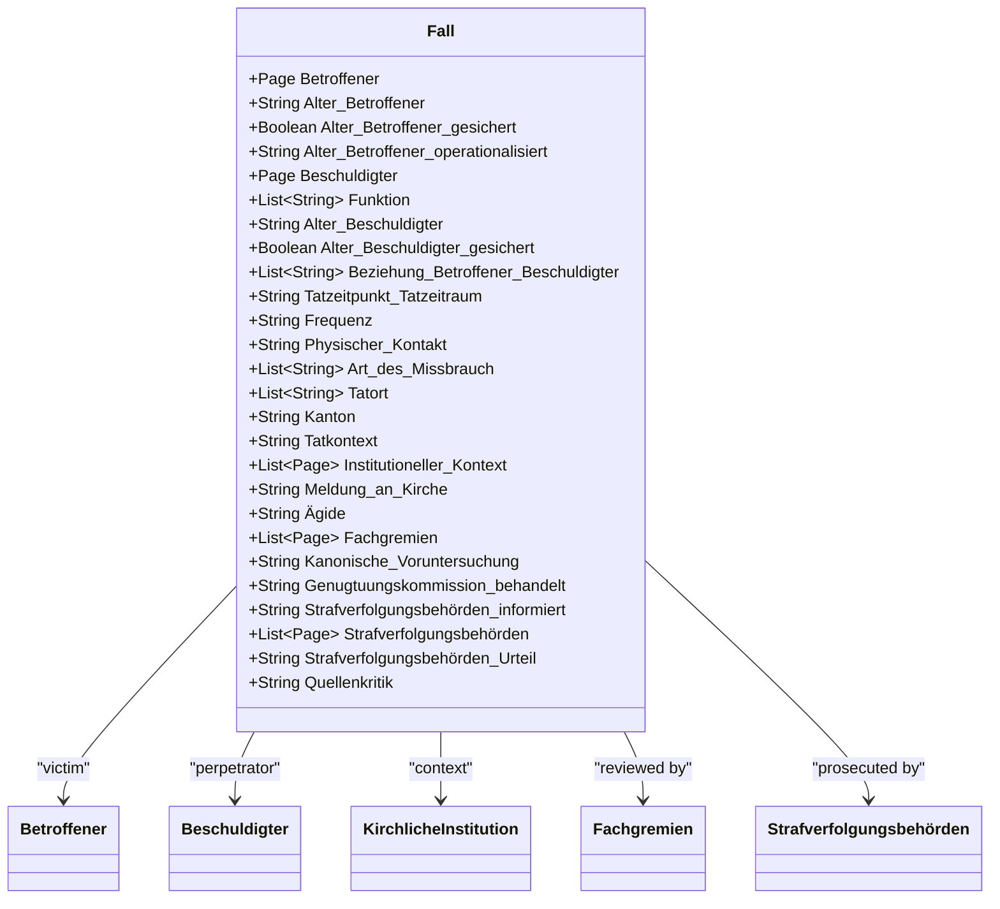
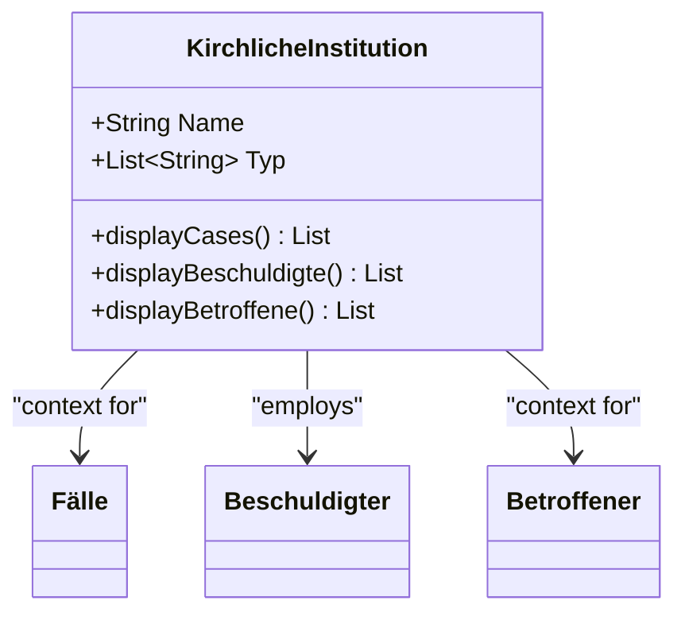
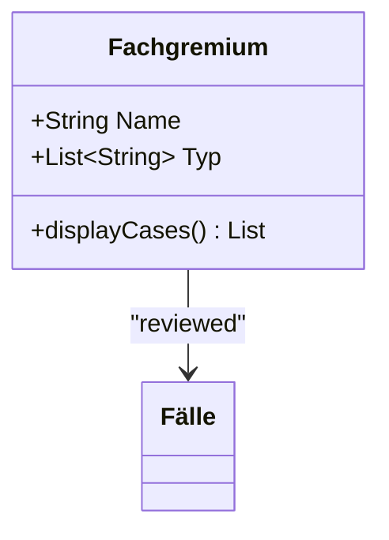
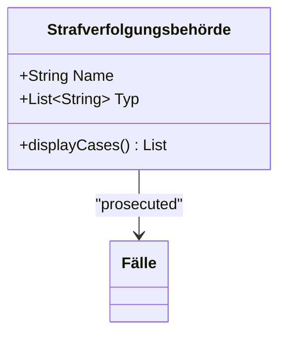
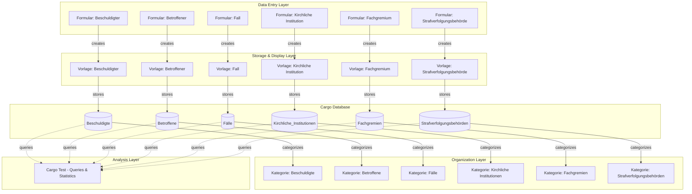
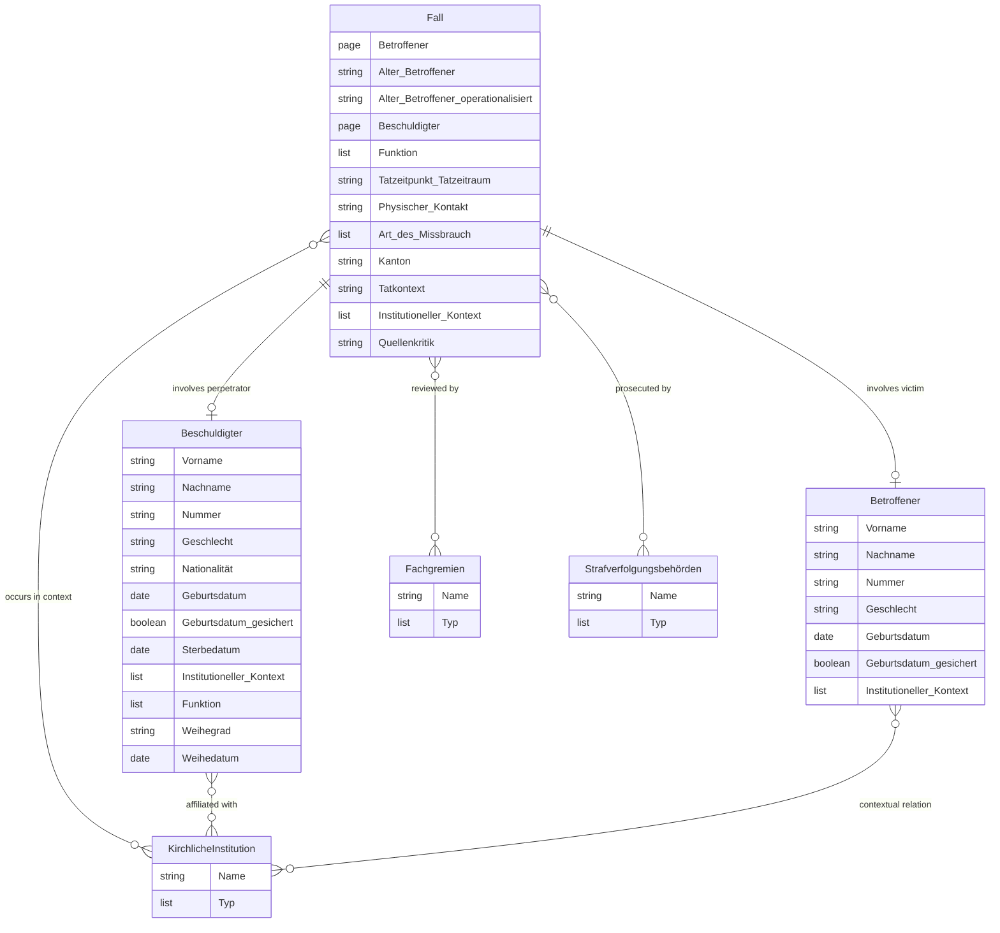
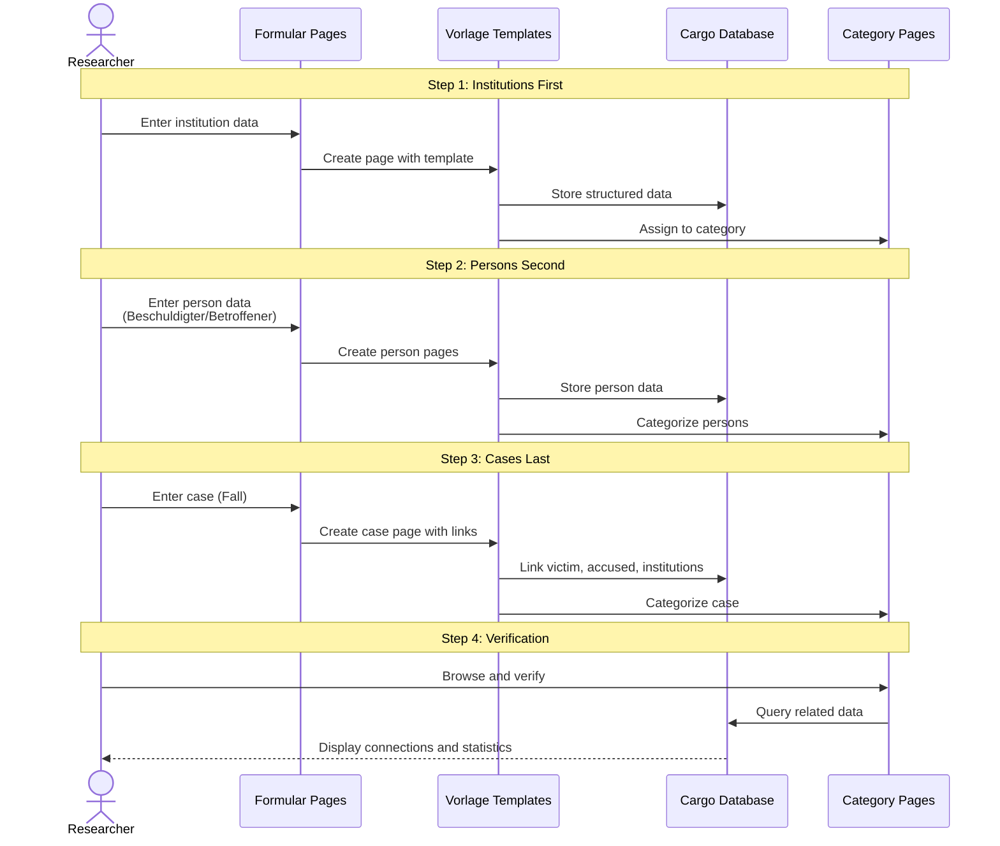

# MediaWiki Templates and PageForms

This directory contains MediaWiki templates, PageForms form definitions, and Cargo category declarations for data entry and display.

## Purpose

This directory separates **data entry interfaces** (how data is entered) from the **data model** (what is stored). This allows:

- UI changes without breaking the data model
- Multiple entry interfaces for the same data
- Customized forms for different user roles
- Evolution of UX without data migration

## Directory Structure

```
data/templates/
├── index.qmd                           # This file
├── Vorlage_*.xml                       # MediaWiki templates for data display
├── Formular_*.xml                      # PageForms form definitions for data entry
├── Kategorie_*.xml                     # Category pages with Cargo declarations
└── Fallbeschreibung.xml                # Case description template
```

## File Types

### 1. Vorlagen (Templates)

Files: `Vorlage_*.xml`

MediaWiki templates define how data is **displayed** on entity pages. They:

- Format the presentation of entity data
- Store data to Cargo tables
- Display relationships to other entities
- Generate infoboxes and structured displays

**Example**: `Vorlage_Fall.xml` defines how a case (Fall) is displayed.

### 2. Formulare (Forms)

Files: `Formular_*.xml`

PageForms form definitions define how data is **entered**. They:

- Create input fields with appropriate types
- Use dropdowns for controlled vocabularies
- Implement conditional fields (show/hide based on other values)
- Provide validation and help text
- Guide users through data entry

**Example**: `Formular_Fall.xml` defines the data entry form for creating a new case.

### 3. Kategorien (Categories)

Files: `Kategorie_*.xml`

Category pages with Cargo declarations define:

- The Cargo table structure (`#cargo_declare`)
- Category membership
- Default queries and displays for category pages

**Example**: `Kategorie_Falle.xml` declares the Cargo table for cases.

## Entities and Files

| Entity                         | Template                            | Form                                 | Category                               |
| ------------------------------ | ----------------------------------- | ------------------------------------ | -------------------------------------- |
| Fall (Case)                    | Vorlage_Fall.xml                    | Formular_Fall.xml                    | Kategorie_Falle.xml                    |
| Betroffener (Affected Person)  | Vorlage_Betroffener.xml             | Formular_Betroffener.xml             | Kategorie_Betroffene.xml               |
| Beschuldigter (Accused Person) | Vorlage_Beschuldigter.xml           | Formular_Beschuldigter.xml           | Kategorie_Beschuldigte.xml             |
| Kirchliche Institution         | Vorlage_Kirchliche_Institution.xml  | Formular_Kirchliche_Institution.xml  | Kategorie_Kirchliche_Institutionen.xml |
| Strafverfolgungsbehörde        | Vorlage_Strafverfolgungsbehorde.xml | Formular_Strafverfolgungsbehorde.xml | Kategorie_Strafverfolgungsbehorden.xml |
| Fachgremium                    | Vorlage_Fachgremium.xml             | Formular_Fachgremium.xml             | Kategorie_Fachgremien.xml              |

## XML File Format

Files are exported from MediaWiki in XML format. They can be:

1. **Imported** into a MediaWiki instance using Special:Import
2. **Viewed/Edited** as text (they contain wikitext in XML wrapper)
3. **Version controlled** in Git

### Example Structure

```xml
<mediawiki>
  <page>
    <title>Template:Fall</title>
    <ns>10</ns>
    <revision>
      <text>
        <!-- Wikitext template code here -->
        {{#cargo_store:_table=Faelle
        |fallnummer={{{fallnummer|}}}
        |titel={{{titel|}}}
        ...
        }}
      </text>
    </revision>
  </page>
</mediawiki>
```

## Installation

⚠️ **Note**: These XML files should be imported into a Semantic MediaWiki installation with the Cargo and PageForms extensions.

### Prerequisites

1. MediaWiki 1.35+ with extensions:
   - Cargo
   - Page Forms (formerly Semantic Forms)
   - (Optional) Semantic MediaWiki

2. Cargo tables must be created after importing categories

### Import Process

1. Navigate to `Special:Import` in your MediaWiki
2. Upload each XML file
3. After importing all category files, run:
   ```
   php maintenance/runJobs.php
   php extensions/Cargo/maintenance/recreateData.php --table Faelle
   php extensions/Cargo/maintenance/recreateData.php --table Betroffene
   php extensions/Cargo/maintenance/recreateData.php --table Beschuldigte
   php extensions/Cargo/maintenance/recreateData.php --table Kirchliche_Institutionen
   php extensions/Cargo/maintenance/recreateData.php --table Strafverfolgungsbehoerden
   php extensions/Cargo/maintenance/recreateData.php --table Fachgremien
   ```

## Creating New Pages

After installation, users can create entity pages using Special:FormStart:

```
Special:FormStart/Fall              # Create a new case
Special:FormStart/Betroffener       # Create a new affected person
Special:FormStart/Beschuldigter     # Create a new accused person
```

Forms automatically:

- Validate input
- Populate Cargo tables
- Assign categories
- Create relationships

## Form Features

### Controlled Vocabularies

Forms use dropdown fields populated from controlled vocabularies:

```wikitext
{{{field|status|input type=dropdown|values=offen,in_bearbeitung,abgeschlossen}}}
```

Or from vocabulary files:

```wikitext
{{{field|kanton|input type=combobox|values from url=vocabularies/kantone.json}}}
```

Note: The path should be relative to the wiki root or configured based on your MediaWiki installation's vocabulary file location.

### Conditional Fields

Fields can be shown/hidden based on other field values:

```wikitext
{{{field|ausgang|input type=dropdown|values=...}}}
{{{field|ausgang_details|input type=textarea|hidden|show on select=ausgang=>verurteilung,freispruch}}}
```

### EDTF Date Fields

Date fields support EDTF format:

```wikitext
{{{field|tatzeit_von|input type=text|placeholder=YYYY or YYYY~ or YYYY/YYYY}}}
```

With help text explaining EDTF syntax.

### Source Criticism Scoring

Forms include guidance for source criticism scoring:

```wikitext
{{{field|quellenkritik_score|input type=dropdown|values=1,2,3,4,5,6,7,8,9,10}}}
{{{info|1=sehr unzuverlässig, 10=hochzuverlässig}}}
```

## Relationship Management

Forms manage entity relationships using:

1. **Autocomplete fields**: Link to existing entities
2. **Multiple instance templates**: Add multiple related entities in one form
3. **Cargo queries**: Display related entities on view pages

Example:

```wikitext
{{{field|betroffene|input type=tokens|values from category=Betroffene|list}}}
```

## Customization

### Adding Fields

1. Update the Cargo declaration in the category file
2. Add the field to the template (for display)
3. Add the field to the form (for input)
4. Recreate Cargo table
5. Update schema documentation in `data/schemas/`

### Modifying Display

Templates can be customized to change how data is displayed without affecting the data model. Common customizations:

- Changing field labels
- Reordering fields
- Adding sections/subsections
- Changing formatting (bold, italic, etc.)
- Adding explanatory text

### Form Layouts

Forms support various layouts:

- Standard (vertical)
- Spreadsheet (tabular for repeated fields)
- Two-column
- Tabs/Sections

## Validation

Forms can include:

- Required fields
- Field type validation (number, date, email, etc.)
- Regular expression validation
- Custom JavaScript validation

## Testing

After making changes:

1. Test form entry with various inputs
2. Verify data is stored correctly in Cargo
3. Check template display
4. Test queries and aggregations
5. Validate relationships between entities

## Privacy Considerations

⚠️ **CRITICAL**: Forms in production should:

1. **Not be publicly accessible** - use MediaWiki permissions
2. **Include privacy notices** - remind users data is sensitive
3. **Use pseudonyms** - never enter real names
4. **Require authentication** - track who enters data
5. **Log access** - audit trail for sensitive data

Real research data is stored in ETH Zürich LeoMed infrastructure, not in a public wiki.

## Related Documentation

- Data Model: [../data/schemas/README.md](../data/schemas/README.md)
- Schema Files: [../data/schemas/](../data/schemas/)
- Controlled Vocabularies: [../data/schemas/vocabularies/](../data/schemas/vocabularies/)

## Extension Documentation

- **Cargo**: https://www.mediawiki.org/wiki/Extension:Cargo
- **Page Forms**: https://www.mediawiki.org/wiki/Extension:Page_Forms
- **Semantic MediaWiki**: https://www.semantic-mediawiki.org/

## Support

For questions about templates and forms:

- See MediaWiki extension documentation
- Review PageForms examples: https://www.mediawiki.org/wiki/Extension:Page_Forms/Quick_start_guide
- Check Cargo documentation: https://www.mediawiki.org/wiki/Extension:Cargo/Storing_data

## Detailed Template Documentation

### System and Navigation Files

#### `Hauptseite.xml` - Main Page (Homepage)

The landing page and navigation hub for the wiki, providing:

- Quick links to forms for data entry
- Category listings for browsing data
- Guidelines for data entry ("Achtung Stolpersteine!")
- Documentation links (EDTF format, source criticism, functions)
- Communication tools (task lists, wish list, team forum)
- Advanced features (Cargo queries, export, PDF generation)

Key sections:

- **Quicklinks**: Fast access to documentation and communication pages
- **Achtung Stolpersteine!**: Important guidelines for consistent data entry
- **How to**: Step-by-step instructions for common tasks
- **Administrator Tasks**: Advanced operations for system administrators

#### `MediaWiki_Sidebar.xml` - Navigation Sidebar

Defines the left sidebar navigation structure with organized access to:

- Cases (Fälle) and Events (Ereignisse) viewing and creation
- Victims (Betroffene) viewing and creation
- Accused persons (Beschuldigte) viewing and creation
- Institutions (Kirchliche Institutionen, Fachgremien, Strafverfolgungsbehörden)
- Quick links and search tools

#### `Fallbeschreibung.xml` - Case Description Template

A simple content template for detailed case narratives with sections for:

- Case description (narrative text)
- Canonical investigations and prosecution authorities (procedural information)
- Sources, literature, and media (references)

This is separate from the structured `Vorlage_Fall.xml` and provides space for qualitative narrative.

### Data Templates (Vorlagen) - Detailed Structure

#### `Vorlage_Beschuldigter.xml` - Accused Person Template



**Storage**: Cargo table `Beschuldigte`

**Fields:**

- **Personal**: First name, last name, identifying number, gender, nationality
- **Biographical**: Birth date (with certainty flag), death date
- **Ecclesiastical**: Institutional context(s), function(s), ordination grade, ordination date
- **Auto-generated Display**: List of associated cases via Cargo query showing Fall, Beschuldigter, Betroffener, and Tatzeitpunkt_Tatzeitraum

**Categories**: Automatically assigned to `Kategorie:Beschuldigte`

#### `Vorlage_Betroffener.xml` - Victim Template



**Storage**: Cargo table `Betroffene`

**Fields:**

- **Personal**: First name, last name, identifying number, gender
- **Biographical**: Birth date (with certainty flag)
- **Context**: Institutional context (when victim was part of institution, e.g., student in boarding school)
- **Auto-generated Display**: List of associated cases via Cargo query

**Categories**: Automatically assigned to `Kategorie:Betroffene`

**Note**: According to wiki guidelines, institutional context is only added when the victim was part of the institution (e.g., student, altar server), not just because they were victimized by someone from that institution.

#### `Vorlage_Fall.xml` - Case Template



**Storage**: Cargo table `Fälle`

**Field Groups:**

- **Victim Data**: Victim (page link), age, age certainty, operationalized age category
- **Accused Data**: Accused (page link), function(s) in this case, age, age certainty
- **Relationship**: Type(s) of relationship between victim and accused
- **Incident Details**: Time/period (EDTF format), frequency, physical contact (yes/no), type(s) of abuse, location(s), canton, context
- **Institutional**: Institutional context(s), reporting to church, episcopal aegis (Ägide)
- **Official Response**: Expert committees, canonical investigation, compensation fund treatment, prosecution informed, prosecution authorities, prosecution verdict
- **Quality**: Source criticism score

**Categories**: Automatically assigned to `Kategorie:Fälle`

**Note**: Function in cases refers to the perpetrator's role during the incident, which may differ from their overall career functions listed on their person page.

#### `Vorlage_Kirchliche_Institution.xml` - Church Institution Template



**Storage**: Cargo table `Kirchliche_Institutionen`

**Fields:**

- Name of institution
- Type(s) of institution (can be multiple)
- **Auto-generated Sections**:
  - Associated cases via Cargo query
  - Accused persons affiliated with this institution
  - Victims with this institutional context

**Categories**: Automatically assigned to `Kategorie:Kirchliche Institutionen`

#### `Vorlage_Fachgremium.xml` - Expert Committee Template



**Storage**: Cargo table `Fachgremien`

**Fields:**

- Name of committee
- Type(s) of committee
- **Auto-generated Display**: List of cases reviewed by this committee via Cargo query

**Categories**: Automatically assigned to `Kategorie:Fachgremien`

#### `Vorlage_Strafverfolgungsbehörde.xml` - Prosecution Authority Template



**Storage**: Cargo table `Strafverfolgungsbehörden`

**Fields:**

- Name of authority
- Type(s) of authority
- **Auto-generated Display**: List of cases handled by this authority via Cargo query

**Categories**: Automatically assigned to `Kategorie:Strafverfolgungsbehörden`

### Analysis and Quality Control

#### `Cargo_Test.xml` - Data Analytics Dashboard

A comprehensive analytics page using Cargo queries for statistical analysis and data quality monitoring.

**Query Categories:**

1. **Summary Statistics:**
   - Total counts: Cases, accused persons, victims
   - Source criticism score distribution
   - Contact type distribution (physical/non-physical)

2. **Abuse Type Analysis:**
   - Non-physical abuse types
   - Physical abuse type combinations
   - Individual physical abuse types (with multiple counting)

3. **Demographic Analysis:**
   - Ordination grades of accused persons
   - Functions of accused in cases
   - Gender distribution (victims and accused)
   - Nationality of accused
   - Birth decade cohorts of accused
   - Birth date known/unknown by institution

4. **Contextual Data:**
   - Victim age categories at time of incident
   - Canton of incident
   - Compensation fund treatment
   - Expert committee involvement
   - Prosecution information and verdicts
   - Temporal patterns (timeline chart with limit=1000)

5. **Data Quality Checks (Troubleshooting):**
   - Persons without gender specification
   - Inconsistent function/ordination combinations
   - Cases missing physical contact classification (St.Gallen and Chur)
   - Accused persons missing birth dates (by institution, e.g., Basel)
   - Age specifications with wrong format (using "-" instead of proper format)
   - Cases with placeholder "FachgremiumFehlt"
   - Cases missing source criticism scores
   - Basel cases missing Ägide information

**Implementation Notes:**

- Uses inline format for simple counts
- Uses table format for distributions
- Uses line chart for temporal analysis
- Includes link=all parameter to make table entries clickable
- Uses HOLDS operator for list field queries
- Uses BINARY comparison for exact page name matching

## System Architecture

### Data Flow



### Entity Relationships



### Data Entry Workflow



## Notes on Current Files

The XML files in this directory have been imported from the active MediaWiki instance. Each file contains:

1. MediaWiki site metadata (site name, namespaces, etc.)
2. Page title and namespace information
3. Revision history
4. Wikitext content with Cargo declarations and queries

These files are ready to be imported into a compatible MediaWiki installation with Cargo and PageForms extensions.

See `data/schemas/` for detailed field-level documentation that aligns with these templates.
