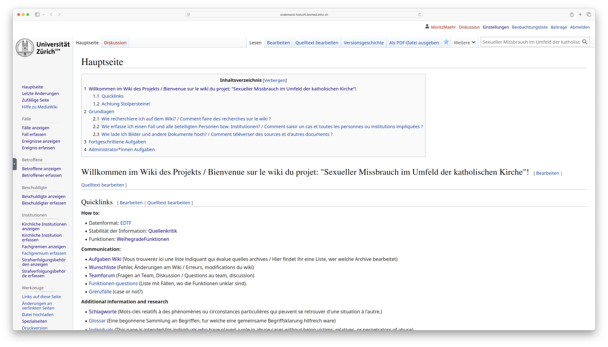
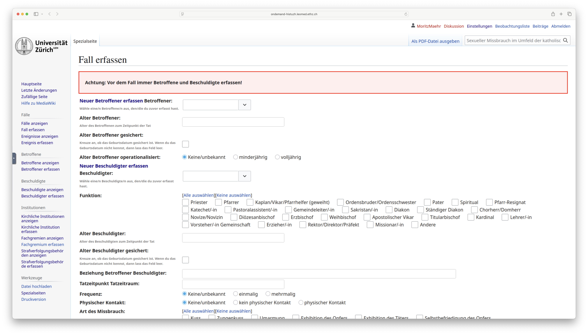
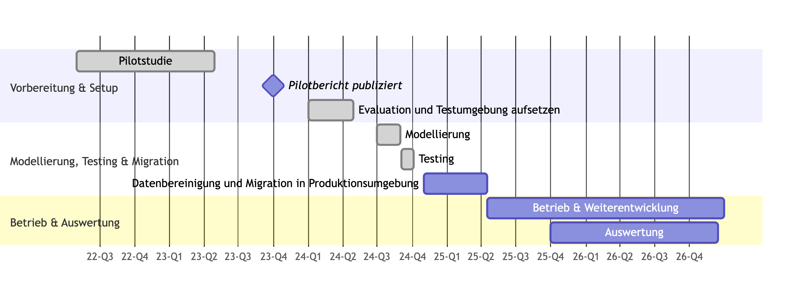
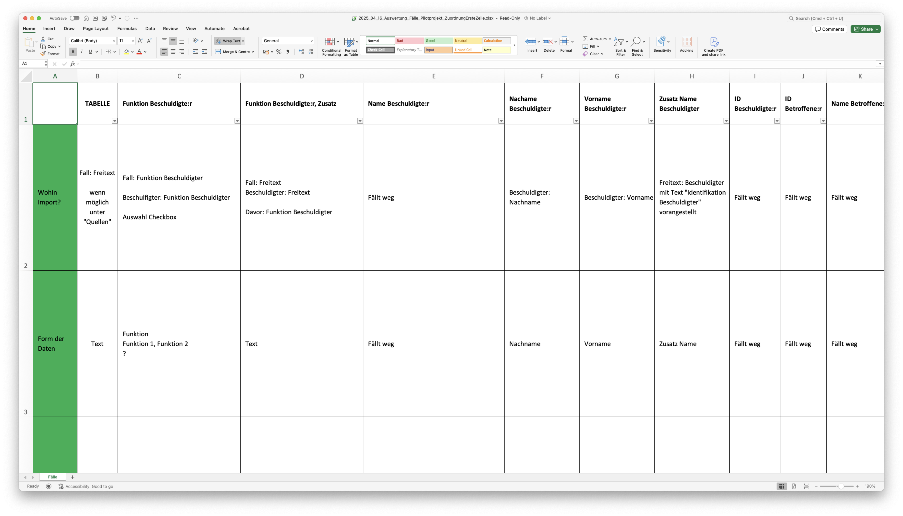
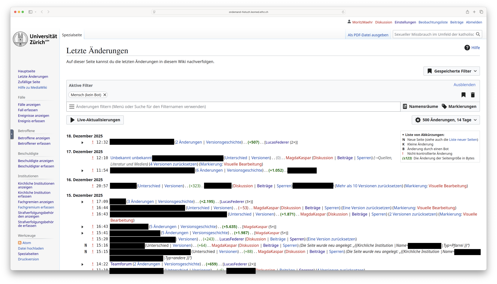
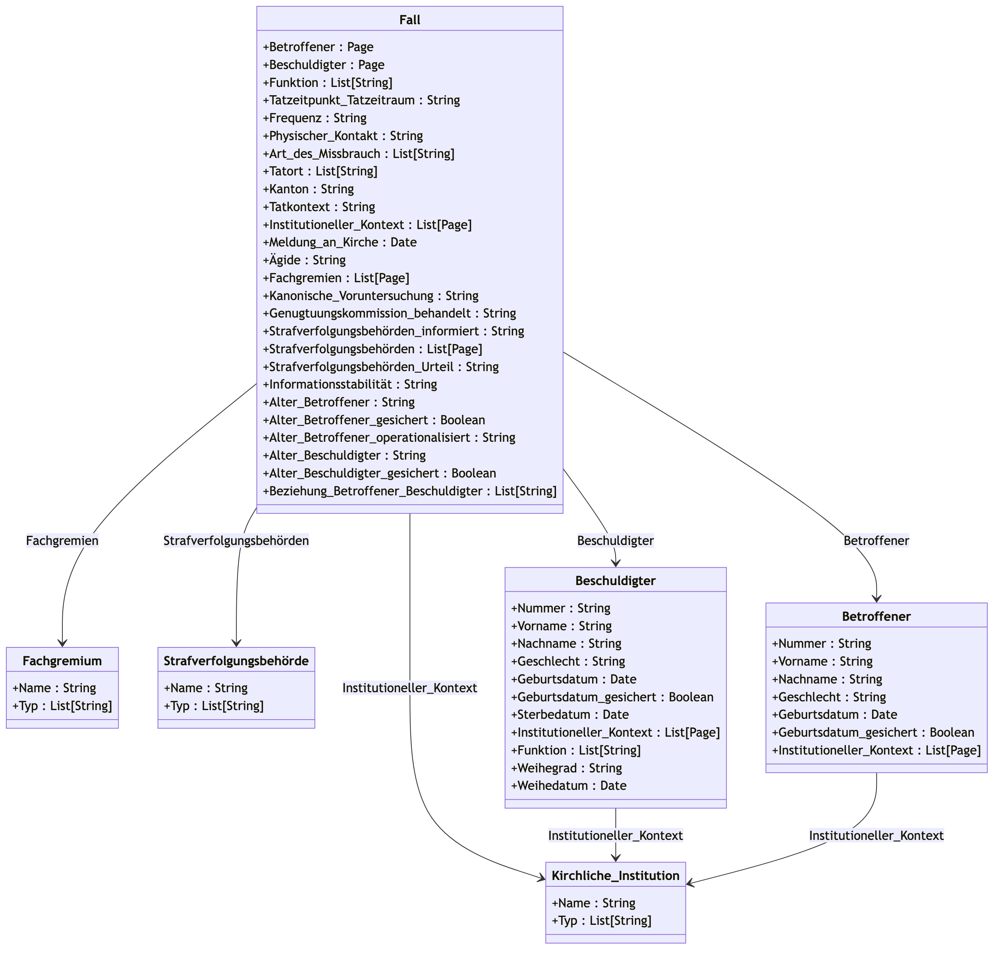
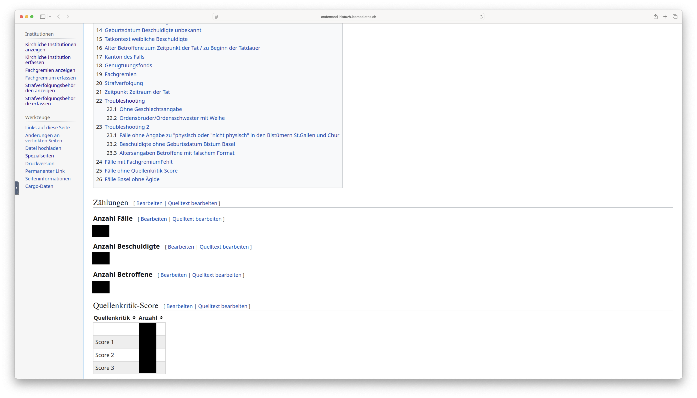

::: {.callout-note}
Publiziert in der *Zeitschrift für digitale Geisteswissenschaften* 11 (2026). DOI: [10.17175/2026_006](https://doi.org/10.17175/2026_006). Letzte Überprüfung aller Verweise: 13.04.2026.
:::

## 1. Von der gesellschaftlichen Dringlichkeit zur digitalen Methode: Einleitung und These

### 1.1 Ein Forschungsprojekt von hoher gesellschaftlicher Dringlichkeit

2022 gab die katholische Kirche in der Schweiz – die Schweizer Bischofskonferenz (SBK), die Römisch-Katholische Zentralkonferenz der Schweiz (RKZ) und die Konferenz der Vereinigungen der Orden und weiterer Gemeinschaften des gottgeweihten Lebens in der Schweiz (KOVOS) – ein Forschungsprojekt in Auftrag, das die systematische historische Aufarbeitung sexuellen Missbrauchs, begangen durch Kleriker und Ordensangehörige in der Schweiz seit den 1950er Jahren, zum Ziel hatte. Durchgeführt wurde die Untersuchung von einem unabhängigen Forschungsteam von Historiker\*innen und Sozialwissenschaftler\*innen der Universität Zürich.

Die Ergebnisse der Vorstudie[^1] erschütterten die Schweizer Öffentlichkeit und markierten eine Zäsur in der Erforschung und Aufarbeitung sexualisierter Gewalt im kirchlichen Kontext der Schweiz. Das Forschungsteam beschrieb ein großes Spektrum an Fällen – von problematischen Grenzüberschreitungen bis hin zu schwersten systematischen Missbräuchen, die über Jahre hinweg andauerten. Insgesamt wurden 1002 Fälle, 510 Beschuldigte und 921 Betroffene identifiziert. Beschuldigte und überführte Kleriker waren systematisch versetzt worden, mitunter auch ins Ausland, um eine Strafverfolgung zu vermeiden und einen weiteren Einsatz zu ermöglichen. Die Studie belegte, dass es in der katholischen Kirche der Schweiz während der ganzen Untersuchungsperiode zu sexuellem Missbrauch kam, der sich über das ganze Land erstreckte und in 74 % der aktenkundigen Fälle Minderjährige betraf. Die Ergebnisse bestätigten ein jahrzehntelanges Muster des »Ignorierens, Schweigens und Bagatellisierens« durch kirchliche Verantwortungsträger.

Die Vertreter\*innen der katholischen Kirche in der Schweiz haben das historische Forschungsprojekt im internationalen Vergleich spät in Auftrag gegeben. Es lag zu Projektbeginn bereits eine beträchtliche Anzahl von Untersuchungen aus verschiedenen Ländern vor, die jedoch unterschiedliche methodische Ansätze verfolgten.[^2] Besonders häufig sind Studien zu sexuellem Missbrauch in einzelnen Bistümern oder Ordensgemeinschaften, was gerade in Deutschland zu einer stark fragmentierten Forschungslandschaft führte.[^3] Dies sollte in der Schweiz mit einer gemeinsamen Auftraggeberschaft aller Bistümer und der Ordensvereinigungen umgangen werden. Das Ziel eines bundesweiten historischen Überblicks über sexuellen Missbrauch in der katholischen Kirche in Deutschland verfolgte auch die 2018 veröffentlichte sogenannte MHG-Studie[^4] (Mannheim – Heidelberg – Gießen), die vornehmlich auf eine quantitative Auswertung von Personalakten durch ein interdisziplinäres Konsortium setzte. Hierbei war allerdings der Zugang zu den Daten aufgrund strenger Datenschutzauflagen und einer Vorselektion durch die katholische Kirche eingeschränkt. In Frankreich wiederum wählte die Commission indépendante sur les abus sexuels dans l’Eglise (›unabhängige Kommission zu sexuellem Missbrauch in der Kirche‹, CIASE) einen Ansatz, der Betroffenenaussagen und statistische Hochrechnungen kombinierte, was zu einer breiten gesellschaftlichen Debatte über die Prävalenz von sexuellem Missbrauch in der katholischen Kirche und in der Gesellschaft allgemein führte.[^5]

Aus den beschränkten Möglichkeiten einer Nachnutzung der Forschungsdaten der MHG-Studie in Deutschland[^6] konnte die Wichtigkeit des Aufbaus einer nachhaltigen Forschungsinfrastruktur abgeleitet werden. Andere Studien, bspw. der Ryan-Report in Irland, der neben Betroffenen- und Zeug\*innenaussagen auf eine große Menge relevanter Archivdokumente zurückgriff, wiesen darauf hin, dass die strukturierte digitale Erfassung von Quellen ein zentraler Arbeitsschritt darstellt, um Missbrauchstaten und die Verantwortung hierfür zu analysieren.[^7]

Nach Abschluss des einjährigen Pilotprojekts und der Veröffentlichung des ersten Berichts im September 2023 begann die Planung des dreijährigen Hauptprojekts (2024–2026). Während die Pilotphase vor allem der Erschließung der Quellenlage, der Bestimmung der Forschungsschwerpunkte und der methodischen Grundlagen diente, rückten nun Fragen der Datenverarbeitung, Datenstrukturierung und der systematischen Quellenkritik in den Vordergrund. Im Rahmen der Pilotphase hatten die Forschenden erstmals Zugang zu umfangreichen kirchlichen Archiven erhalten, die zuvor für wissenschaftliche Untersuchungen verschlossen gewesen waren. Diese Bestände umfassten zehntausende Seiten an Personalakten, Korrespondenzen, internen Untersuchungsberichten und Verwaltungsdossiers. Hinzu kamen Quellen aus staatskirchenrechtlichen Strukturen, den äußerst heterogenen Ordensarchiven und den ebenfalls sehr vielfältigen staatlichen Behörden. Schließlich kamen auch Aussagen und Berichte von Betroffenen und Zeitzeug\*innen hinzu, die in Gesprächen mit den Forschenden von den Übergriffen berichteten, die sie im Umfeld der katholischen Kirche erlebt hatten.

Die Menge, Vielfalt und Sensibilität des zur Verfügung stehenden Quellenmaterials machten deutlich, dass eine herkömmliche gemeinsame Dateiablage den Anforderungen eines dezentral arbeitenden Forschungsteams nicht genügen würde. Im Zuge der Planung mussten daher grundlegende Entscheidungen darüber getroffen werden, welche Art von Datenbank eingesetzt, welche Daten erfasst und in welcher Form sie verarbeitet werden sollten. Dabei galt es, verschiedene Ansprüche miteinander zu verbinden: die wissenschaftliche Nachvollziehbarkeit der Datenerfassung, den Schutz personenbezogener und vertraulicher Informationen, die Kompatibilität mit unterschiedlichen Archivsystemen sowie die langfristige Sicherung und Wiederverwendbarkeit der Forschungsdaten.

Der vorliegende Artikel beschreibt diese Diskussion und analysiert die Entwicklung, die Einführung und den Einsatz einer Forschungsdatenbank sowie ihre epistemologischen Implikationen im Rahmen des historischen Forschungsprojekts [Sexueller Missbrauch im Umfeld der römisch-katholischen Kirche in der Schweiz seit Mitte des 20. Jahrhunderts](https://www.hist.uzh.ch/de/fachbereiche/neuzeit/privatdozierende/meier/forschung/forschungsprojekte/sexueller-missbrauch.html).[^8] Im Folgenden diskutiert der Beitrag zunächst den Wandel des Arbeitsprozesses von einer geteilten Excel-Tabelle hin zu einer spezialisierten Forschungsumgebung und zeigt, wie sich dabei Quellenarbeit und Datenmodellierung verschränken. Anschließend rückt die kollaborative Dimension in den Fokus: Die Datenbankentwicklung wird als soziotechnischer Aushandlungsprozess beschrieben, in dem sich methodische, sprachliche und institutionelle Differenzen niederschlagen. Darauf aufbauend werden die neuen Erkenntnishorizonte skizziert, die das relationale Datenmodell eröffnet – insbesondere im Hinblick auf systemische Muster der Vertuschung. Den Abschluss bilden ein systematisierendes Fazit, Empfehlungen für ähnliche Projekte sowie eine Reflexion der Grenzen des Ansatzes.

### 1.2 Die methodischen Herausforderungen hochsensibler, heterogener Daten

Die Bestände der Archive von Schweizer Diözesen, Orden und weiteren kirchlicher Institutionen bildeten die zentrale Quellenbasis des Projekts. Weiter wurden auch Akten aus nicht-kirchlichen Archiven hinzugezogen. In vielen kantonalen Staatsarchiven wurden Recherchen zu Strafverfahren und Gerichtsurteilen gegen katholische Kleriker durchgeführt und tausende Aktenseiten mit Untersuchungsdossiers, Gutachten, Urteilen und Begründungen gesichtet.

Neben der Arbeit mit archivalischen Quellen wurden im Projektverlauf mittels der Methode der Oral History zudem weit über 100 Betroffenen- und Zeitzeug\*innenberichte erfasst. Je nach Wunsch der interviewten Personen wurden diese Gespräche entweder händisch protokolliert oder digital aufgenommen. Aus den Audiofiles wurde dann mit einem lokalen KI-Modell ([Whisper](https://openai.com/index/whisper/)) ein Transkript erstellt. Dabei wurden auch in Schweizerdeutsch (Mundart) geführte Interviews in schriftdeutscher Sprache transkribiert, um die Durchsuchbarkeit nach Schlüsselbegriffen zu gewährleisten. Ebenfalls wurden Dokumente und Fotos, die Betroffene und Zeitzeug\*innen dem Forschungsteam zur Verfügung stellten, in jedem Fall digitalisiert.

Das Forschungsvorhaben stand von Beginn an vor zwei zentralen methodischen Herausforderungen: Zum einen sollte das Projekt den ethischen und rechtlichen Standards im Umgang mit sensiblen personenbezogenen Daten gerecht werden. Die konsultierten Quellen dokumentieren schwerste Rechtsverletzungen und tiefes menschliches Leid. Sie enthalten große Mengen an sensiblen und besonders schützenswerten Personendaten. Sexuelle Missbräuche sind vielfach dokumentiert durch medizinische Berichte, intime persönliche Schilderungen, Unterlagen aus Strafverfahren, teilweise auch private Kommunikation oder Fotografien. Dies erlegt dem Projekt eine außerordentliche ethische Verantwortung auf und erfordert eine technische Infrastruktur, die Sicherheit, Datenschutz und einen betroffenen-zentrierten Ansatz als oberste Prioritäten behandelt.

Zum anderen war und ist das Projekt mit einer zutiefst fragmentierten und heterogenen Quellenbasis konfrontiert. Die kirchliche Archivlandschaft vereint unterschiedliche institutionelle, sprachliche und regionale Kontexte und umfasst sowohl schriftliche als auch mündliche Überlieferungen. Während einige Archive über zugängliche Verzeichnisse verfügen, die eine selbstständige Arbeit ermöglichten, war in anderen eine enge Zusammenarbeit mit den lokalen Archivar\*innen unerlässlich, da nur sie die ›innere Logik‹ der Bestände kannten. Teilweise lagerten wichtige Unterlagen in alten Schränken, über deren Inhalt kein Überblick bestand. In anderen Bistümern waren hingegen historische Personenverzeichnisse in Form von Datenbanken vorhanden, welche Personal- und Pfarreiakten sowie teilweise auch Protokolle von Ausschüssen und Gremien mit den entsprechenden Personen verknüpften.

Bis auf einige elektronisch geführte Korrespondenzen lagen die identifizierten Quellen in allen kirchlichen Archiven in Papierform vor. Um sie für das Forschungsprojekt nutzbar und vor allem verknüpfbar zu machen, wurden diese digitalisiert und mittels OCR maschinenlesbar gemacht.

Die Heterogenität der kirchlichen Archive ist keine rein technische Unannehmlichkeit, sondern ein historisches Faktum von großer Aussagekraft. Sie spiegelt die unterschiedlichen Prioritäten, Ressourcen und institutionellen Kulturen der Bistümer über Jahrzehnte wider. Eine unstrukturierte, lückenhafte oder gar nicht erst erfolgte Aktenführung kann trotz der formalen Einhaltung der Vorschriften des kircheninternen ›kanonischen Rechts‹ unter bestimmten Umständen als Hinweis auf problematische institutionelle Praktiken interpretiert werden. Die Pilotstudie konnte für zwei Diözesen zudem die Vernichtung von Akten nachweisen.[^9]

Folglich galt es, Informationen aus verschiedenen Archiven, Dokumenttypen und Erhebungsformaten so zu erfassen, dass sie vergleichbar, auswertbar und wissenschaftlich überprüfbar bleiben. Die heterogene Quellenbasis erforderte eine strukturierte und zugleich flexible Form der Datenerhebung, -‍speicherung und -‍auswertung.

### 1.3 Infrastruktur als methodisches Investment

Die zentrale These dieses Artikels lautet, dass ein hoher Aufwand für den Aufbau einer maßgeschneiderten, sicheren und kollaborativen digitalen Forschungsumgebung keinen rein vorbereitenden technischen Schritt darstellt, sondern ein fundamentales methodisches Investment. Diese Investition ist für den Erfolg dieses Projekts zentral. Sie prägt den Forschungsprozess mit und erlaubt historische Erkenntnisse, die mit traditionellen, analogen Methoden schwer zu erreichen sind. Die für dieses Projekt entwickelte Datenbank ist somit nicht nur ein Behälter für Daten, sondern ein epistemologisches Instrument, das die Art und Weise, wie historische Fragen gestellt und beantwortet werden können, entscheidend verändert und erweitert hat.

Mareike König und Simone Lässig fordern, dass die Geschichtswissenschaft die digitale Transformation des Fachs anerkennt und kritisch gestaltet.[^10] Das Team hat diese Forderung ernst genommen und ist die daraus erwachsenden Herausforderungen mit theoretisch fundierten Strategien angegangen. Dabei bestand nicht nur ein erhöhter Koordinationsaufwand, weil das Team für die Hauptstudie nochmals vergrößert wurde, sondern auch, weil sich die Rollen im Team ausdifferenzierten und verschiedene disziplinäre Hintergründe vertreten waren. Dies ging mit unterschiedlichen Problemlösungsansätzen, Erwartungen und Werkzeugen einher. Das Forschungsteam reagierte mit einem wissenschaftlichen Projektmanagement auf diese Herausforderung, das sich die Heterogenität der Gruppe zunutze gemacht hat und den gemeinsamen Forschungsrahmen als *Trading Zone*[^11] begreift und die teilweise divergierenden Ansprüche der Stakeholder, bestehend aus Auftraggebenden, Betroffenen, Forschenden und der Öffentlichkeit, konsequent mitdenkt.[^12] Innerhalb der *Trading Zone* mussten ein gemeinsames Modell[^13] und eine geteilte Beschreibungssprache ausgebildet werden, die dem hermeneutischen Anspruch des Projekts auch unter digitalen Bedingungen Rechnung trägt.[^14] Dafür mussten in einem iterativen Prozess konventionelle Forschungspraktiken expliziert, ins Digitale übersetzt und in ein kontinuierlich angepasstes Forschungsdatenmanagement[^15] eingebettet werden. Das schuf die Grundlage dafür, dass computergestützte Methoden gewinnbringend vom gesamten Team eingesetzt und Daten und Werkzeuge, soweit es der Persönlichkeitsschutz zulässt, offen und frei zugänglich zur Verfügung gestellt werden können. Die vollständige Dokumentation der Datenmodelle, kontrollierten Vokabulare und der technischen Infrastruktur wurde unter offener Lizenz veröffentlicht, um Transparenz und Nachnutzbarkeit zu gewährleisten.[^16]

Die hier dokumentierten Erfahrungen sind im Diskurs zur Professionalisierung des Forschungsdatenmanagements in den Digital Humanities zu verorten. In Anlehnung an Marina Lemaire wird Datenmanagement dabei nicht als zusätzliche Infrastrukturaufgabe verstanden, sondern als dem Forschungsprozess inhärente Praxis.[^17] Die notwendige Explizitmachung von Fragestellungen, Materialien, Methoden und Workflows schärft demnach den Forschungsprozess selbst. Auf dieser datenbezogenen Explizitheit aufbauend wird Projektmanagement relevant. Während Cremer et al. Projektmanagement zwar als eine für wissenschaftliche Projekte zentrale Kompetenz benennen, zugleich aber dessen seltene konsequente Umsetzung feststellen, zielt die vorliegende Studie darauf, implizites Erfahrungswissen durch die transparente Dokumentation von Aufwand, Fehlern und Umwegen für andere Projekte nutzbar zu machen.[^18]

## 2. Von der Excel-Tabelle zur Forschungsumgebung: Der Wandel des Arbeitsprozesses

Der Übergang von einer geteilten Excel-Tabelle zu einer datenbankgestützten Forschungsumgebung markiert den Kern des hier vertretenen Arguments: Die digitale Infrastruktur ist nicht nur eine logistische Voraussetzung, sondern ein methodisches Instrument. Am Beispiel des Wechsels von der Pilot- zur Hauptstudie lässt sich zeigen, wie sich die Logik der Quellen in ein Datenmodell übersetzt, wie dies die alltägliche Forschungsarbeit verändert und welche epistemischen Effekte daraus entstehen.

### 2.1 Die Logik der Quellen als Strukturbasis

Die Struktur der Excel-Tabelle folgt im Grundsatz der inneren Logik der Quellen. Ausgangspunkt war jeweils ein Fall, dem eine betroffene und eine beschuldigte Person zugeordnet wurden.

Seit der Jahrtausendwende haben sich Betroffene von sexuellem Missbrauch zunehmend bei kirchlichen und unabhängigen Anlaufstellen gemeldet und ihre persönliche Geschichte geschildert. Gleichzeitig führt die katholische Kirche zu jedem kirchlichen Angestellten mit einer sogenannten ›missio‹ – einem bischöflichen Auftrag – ein Personendossier. Diese Dossiers enthalten unter anderem auch Hinweise auf Missbrauchsfälle und den Umgang der Verantwortlichen mit der beschuldigten Person. Damit sind die zentralen Quellen zum kirchlichen Missbrauch personenzentriert und stellen die individuelle Tat in den Mittelpunkt. Dieser Logik folgte auch die Excel-Liste. In ihrer definitiven Ausführung vor dem Abschluss des Pilotprojekts enthielt sie pro Fall eine Zeile mit folgenden Angaben:

- Beschuldigte Person: Funktion, Name und eine jeweils eindeutige Identifikationsnummer.
- Betroffene Person: Geschlecht, Geburtsdatum, Alter zum Tatzeitpunkt.
- Tatkontext: Zeitraum, Frequenz und Dauer der Taten, Art der Beziehung zwischen betroffener und beschuldigter Person sowie die zeitliche Einordnung.
- Institutioneller Kontext: Tatort, Kanton, Art der Institution, deren Träger und das zuständige Bistum.
- Quellen und Nachvollziehbarkeit: Herkunft der Information, Signaturen, Serverpfade und Informant\*innen.
- Institutioneller Umgang: Fallbearbeitungen durch kirchliche Fachgremien, Genugtuungskommissionen sowie staatliche und kirchliche Behörden.
- Qualitative Inhalte: Zusammenfassung des Übergriffs, beschriebene Folgen, Hinweise auf Literatur- und Medienberichte sowie weitere mögliche Bestände und Bemerkungen.

Insgesamt stellte die Tabelle eine prosopographische und institutionelle Grundlage dar, die sowohl quantitative als auch qualitative Analysen zu Häufigkeit, Kontext und institutionellem Umgang mit den Fällen erlaubte.

So wichtig die Zusammenführung heterogener Quellen in einem zentralen Excel-File für eine ›Auslegeordnung‹ zum Thema war, so schnell zeigten sich die Beschränkungen und Probleme, die sich dadurch ergaben. Eine Excel-Tabelle, die über tausend Zeilen und gleichzeitig pro Zeile mehrere lange Textfelder enthält, erwies sich zunehmend als unübersichtlich und fehleranfällig. Es kam wiederholt vor, dass bei Dutzenden Spalten versehentlich die falschen ausgewählt und Informationen so falsch verknüpft wurden. Für eine Übersicht eines einzelnen ›Falles‹ musste weiter eine Zoomstufe gewählt werden, die den Text praktisch unleserlich machte. Die Unübersichtlichkeit der Tabelle schränkte dabei auch die Länge der Fallbeschreibungen ein, die sich teilweise über mehrere Bildschirmseiten erstrecken konnten und die Orientierung in der Tabelle weiter erschwerten. In einer flachen Tabelle lässt sich Relationalität zwar grundsätzlich abbilden, doch führt dies zu zahlreichen Duplikaten, die manuell gepflegt und laufend synchronisiert werden müssen.

Ähnliche Probleme stellten sich bei der Analyse der Daten. Excel erlaubt es zwar, große Datenmengen zu sortieren, zu filtern und statistisch auszuwerten, ist aber für reproduzierbare Auswertungen in kollaborativen Forschungszusammenhängen nur eingeschränkt geeignet. Abfragen müssen manuell zusammengesetzt werden, Filterschritte werden nicht automatisch protokolliert, und Zwischenergebnisse lassen sich nur begrenzt transparent dokumentieren. Hinzu kamen plattformbedingte Unterschiede zwischen Mac- und Windows-Systemen, die sich in der Zeichencodierung, in Datumsformaten und in der Formatierung längerer Texte niederschlugen. Dies führte zu wiederkehrenden Inkonsistenzen und machte nachträgliche Bereinigungen notwendig, die weder skalierbar noch methodisch befriedigend waren.

Zudem war eine strukturierte Erfassung komplexer, relationaler Forschungsdaten nur bedingt möglich. Gerade die Beziehungen zwischen verschiedenen Entitäten konnten nur vereinfacht dargestellt werden, womit komplexere Zusammenhänge grundsätzlich zwar sichtbar waren, doch zeitaufwendig rekonstruiert werden mussten. So wurden in der Excel-Tabelle beispielsweise zwar die Tatorte erfasst, doch musste bei mehreren hundert Fällen jeweils manuell ermittelt werden, welche Orte oder Regionen mehrfach vorkamen. Ähnliches galt für die Zeitangaben: Ohne strukturierte Datierung oder automatisierte Vergleichsfunktionen ließen sich zeitliche Überschneidungen und wiederkehrende Muster nur mit erheblichem Aufwand identifizieren.

Die methodische Herausforderung bestand somit darin, ein System zu entwickeln, das diese disparaten, inkonsistenten und teils unvollständigen Quellen aufnehmen, harmonisieren und in eine kohärente, analysierbare Form bringen kann, ohne dabei die wichtigen Informationen über ihre Herkunft und ihren archivalischen Kontext zu verlieren.

Um die heterogenen Daten langfristig konsistent, nachvollziehbar und kollaborativ verarbeiten zu können, entschied sich das Forschungsteam im Rahmen des Hauptprojekts für den Aufbau einer Forschungsdatenbank auf Basis eines [MediaWiki-Systems](https://www.mediawiki.org/wiki/MediaWiki) mit den Erweiterungen [Cargo](https://www.mediawiki.org/wiki/Extension:Cargo/de) und [Page Forms](https://www.mediawiki.org/wiki/Extension:Page_Forms/de). Dabei handelt es sich um ein semantisches Wiki-System, das unstrukturierte Texte und strukturierte Daten in derselben Darstellung vereinen kann.[^19]

Die Kombination von Freitext und strukturierten Daten erwies sich insbesondere für die historische Analyse von sexuellem Missbrauch als zentral, da viele Aspekte der Quellen nur qualitativ erfassbar sind – etwa narrative Beschreibungen, Kontextinformationen oder Reaktionen auf Meldungen durch kirchliche oder staatliche Akteure.[^20] Das Wiki ermöglicht es, Einträge inhaltlich zu beschreiben und zugleich mit klar definierten Datenfeldern zu versehen, die für quantitative Auswertungen herangezogen werden können. Personenbezogene Informationen können in Beziehung zu übergeordneten institutionellen Kontexten gesetzt werden – etwa zu Bistümern, Orden, kirchlichen Schulen oder auch staatlichen Behörden. Dadurch wurde sichtbar, wie sich bestimmte Handlungslogiken oder Muster über einzelne Fälle hinaus fortsetzten. Das Datenmodell trug somit nicht nur zur besseren Strukturierung der Informationen bei, sondern eröffnete auch neue Perspektiven auf die institutionelle Dimension sexuellen Missbrauchs im Umfeld der katholischen Kirche. Das Datenmodell mit seinen Entitätsbeziehungen zwischen Fällen, Betroffenen, Beschuldigten und institutionellen Kontexten ist vollständig dokumentiert und als Entity-Relationship-Diagramm (vgl. @fig-missbrauch-006) visualisiert zugänglich.[^21]

::: {#fig-missbrauch-001}

Die Startseite des projektinternen MediaWikis der Universität Zürich zum Forschungsprojekt *Sexueller Missbrauch im Umfeld der katholischen Kirche* mit Links zu Anleitungen zur Benutzung des Wikis. [Screenshot: Mähr et al. 2026, CC BY-NC-SA 4.0]
:::

Ebenfalls wurden die Sicherheitsmaßnahmen deutlich ausgebaut und die gesamte digitale Infrastruktur des Projekts auf die Lösung [LeoMed](https://sis.id.ethz.ch/services/sensitiveresearchdata/) der ETH Zürich verlegt, die eine hochsichere Serverumgebung bietet – ursprünglich für die Bedürfnisse der medizinischen Forschung konzipiert. LeoMed ermöglicht es Wissenschaftler\*innen, sicher mit sensiblen Forschungsdaten zu arbeiten. Die Plattform stellt dafür eine Umgebung bereit, in der technische und organisatorische Maßnahmen die Vertraulichkeit, Integrität und Verfügbarkeit der Daten gewährleisten. Jede Forschungsgruppe arbeitet dabei in einem privaten, isolierten Netzwerkbereich, der sämtliche Zugriffs-, Rechen- und Datenressourcen umfasst und durch mehrere Sicherheitsebenen geschützt ist. Dadurch wird sichergestellt, dass vertrauliche Informationen nur autorisierten Personen zugänglich sind und in einer kontrollierten, nachvollziehbaren Weise verarbeitet werden können.[^22]

### 2.2 Verschmelzung von Quellenarbeit und Datenmodellierung: Ein interpretativer Akt

Der Übergang von persönlichen Notizen und einer geteilten Excel-Tabelle zu einer strukturierten Datenbankerfassung stellt eine fundamentale Transformation des historischen Arbeitsprozesses dar. Die Dateneingabe mittels spezifisch entwickelter Formulare mit vordefinierten Auswahlmöglichkeiten ist kein neutraler Akt der Transkription, sondern eine Verschmelzung von Quellenarbeit und Datenmodellierung. Das Design dieser Formulare – die Festlegung von Entitäten wie ›Beschuldigter‹[^23], ›Betroffener‹ oder ›Fall‹ sowie die Definition der dazugehörigen Felder und die Entwicklung kontrollierter Vokabulare – stellt einen tiefgreifenden interpretativen Prozess dar. Es zwingt die Forschenden, bereits im Moment der Datenerfassung analytische Entscheidungen zu treffen, die in der analogen Welt oft erst im späteren Schreibprozess explizit werden.

::: {#fig-missbrauch-002}

Formularseite des projektinternen MediaWiki zur Erfassung eines neuen Falls im Forschungsprojekt *Sexueller Missbrauch im Umfeld der katholischen Kirche*. [Screenshot: Mähr et al. 2026, CC BY-NC-SA 4.0]
:::

Diese Praxis realisiert eine zentrale Forderung der Digital History, wie sie Torsten Hiltmann formuliert hat: die Notwendigkeit, von der reinen Betrachtung digitalisierter Quellen als Texte und Bilder zu einem Verständnis dieser Quellen *als Daten* überzugehen.[^24] Das im Projekt entwickelte Datenmodell ist demnach mehr als eine technische Spezifikation; es ist die formalisierte Hypothese über die Struktur des zu untersuchenden historischen Phänomens. Es legt fest, welche Beziehungen als relevant erachtet werden und welche Informationen systematisch erfasst werden müssen, um diese Beziehungen analysieren zu können. Dieser Prozess verdeutlicht die These von Marina Lemaire, dass Forschungsdatenmanagement keine externe administrative Aufgabe, sondern intrinsisch in den Forschungsprozess selbst eingebettet ist.[^25] Die Modellierung der Daten ist ein zentraler Teil der historischen Untersuchung, der die möglichen Fragestellungen vorstrukturiert und die späteren Analysemöglichkeiten definiert.

### 2.3 Iterative und reflexive Modellierung: Das Beispiel ›Informationsstabilität‹ und ›Quellenkritik‹

Ein prägnantes Fallbeispiel für die methodische Reflexivität des Projekts ist die Weiterentwicklung eines zentralen Datenfeldes von ›Informationsstabilität‹ zu ›Quellenkritik‹. Ausgangspunkt war die Einsicht, dass sich hinter der Entität ›Fall‹ höchst unterschiedliche Quellenkonstellationen verbergen. Einige Fälle stützen sich auf umfangreiche Gerichtsprotokolle, Vernehmungen, Geständnisse oder dichte Verwaltungsakten. Andere sind einzig über eine vage persönliche Erinnerung fassbar, vielfach Jahrzehnte nach der Tat, mit fehlenden Namen, ungenauen Datierungen oder bruchstückhaften Schilderungen.

Das zunächst eingeführte Feld ›Informationsstabilität‹ versuchte, diese Heterogenität durch eine Prüfung des Gewissheits- oder Wahrheitsgrads zu operationalisieren. Implizit lag diesem Ansatz ein positivistisches Verständnis von Evidenz zugrunde: Je mehr und je umfangreichere Quellen vorliegen, desto stabiler die Information. Die praktische Arbeit mit den Quellen zeigte jedoch rasch die Grenzen dieses Modells. Gerade in der historischen Forschung zu sexualisierter Gewalt ist es weder möglich noch sinnvoll, Wahrheit im Sinne aussagepsychologischer oder juristischer Standards festzuschreiben. Ein Fall mit sehr spärlichen Angaben kann nicht als weniger wahr gelten als ein aktenreich dokumentierter Fall; vielmehr spiegeln die Unterschiede im Dokumentationsgrad institutionelle Macht- und Sagbarkeitskonstellationen sowie die Logik der Archivierung. Theoretisch markiert die Abkehr von diesem Modell den von Johanna Drucker geforderten Schritt von *Data* (dem vermeintlich objektiv Gegebenen) zu *Capta* (dem aktiv Genommenen und Konstruierten): Historische Daten sind in diesem Sinne niemals neutrale Fakten, sondern immer das Ergebnis interpretativer Akte.[^26]

Vor diesem Hintergrund wurde das Feld neu konzipiert und in ›Quellenkritik‹ überführt. Statt einen Wahrheitswert zuzuweisen, werden nun systematisch die Eigenschaften der zugrunde liegenden Quellen erfasst. Zu diesem Zweck wurde ein kurzer Fragenkatalog mit acht Punkten entwickelt – vier Fragen zur äußeren Quellenkritik (Provenienz, Entstehungszeit, Überlieferungskontext, formale Merkmale) und vier zur inneren Quellenkritik (Perspektive, Intention, Konsistenz, erkennbare Leerstellen). Die Antworten werden in einem dreistufigen Quellenkritik-Score (1–3) zusammengeführt, der auf einen Blick erkennen lässt, auf welcher Art von Überlieferung ein Fall basiert und wie stark diese Überlieferung durch institutionelle Perspektiven geprägt ist. Der Score dient nicht zur Disqualifizierung von Fällen, sondern als heuristisches Instrument, um differenziert mit diesen weiterarbeiten zu können. Die Umbenennung und Neukonzeption des Feldes als ›Quellenkritik‹ spiegelt also ein gereiftes geschichtswissenschaftliches Verständnis wider. Diese Verschiebung vom Wahrheitswert zur Quellencharakteristik entspricht dem, was Pascal Föhr als Kernaufgabe einer digitalen Quellenkritik beschreibt: Statt nur nach Authentizität zu fragen, müssen bei digitalen Objekten auch deren technische Entstehungsbedingungen, Formatierung und Speicherung systematisch dokumentiert werden.[^27] Es geht primär darum, die Charakteristika der dem Fall zugrunde liegenden Quellen, ihre Perspektive, ihre Entstehungsumstände und ihre potenziellen Verzerrungen zu dokumentieren.

Diese Änderung ist das Ergebnis eines iterativen Prozesses: Die Auseinandersetzung mit dem Quellenmaterial erzwingt eine Anpassung des Datenmodells, was wiederum die Art und Weise verändert, wie die Quellen gelesen und interpretiert werden. Andreas Fickers bezeichnet diese Wechselwirkung treffend als »digitale Hermeneutik«, in der die Kritik der Quelle und die Kritik des digitalen Werkzeugs untrennbar miteinander verschränkt sind.[^28] Dieser hermeneutische Zirkel zwischen Material und digitaler Struktur ist zentral für das Projekt. Heuristisch anschlussfähig ist hier die von Anna Dönecke beschriebene Dynamik, wie der Übergang »von seriellen Quellen zu modellierten Daten« einen ständigen »Perspektivwechsel« mit sich bringt.[^29] Die Technologie hat hier nicht einfach eine vordefinierte Methodik umgesetzt; vielmehr haben sich Technologie und Methodik in der Forschungspraxis wechselseitig geformt und weiterentwickelt.

### 2.4 Lernkurve und Aneignung digitaler Werkzeuge: Ein soziotechnischer Prozess

Die Einführung der digitalen Forschungsumgebung erforderte einen intensiven Lern- und Aneignungsprozess im gesamten Team. Anhand der Projektdokumentation lässt sich dieser soziotechnische Prozess rekonstruieren. Er umfasste Evaluation und Aufsetzen der Plattform, gemeinsame Modellierung und Testing sowie Betrieb und Weiterentwicklung.

::: {#fig-missbrauch-003}

Zeitlicher Überblick der Projektphasen und zentralen Arbeitspakete von 2022 bis 2026. [Diagramm: Mähr et al. 2026, CC BY-NC-SA 4.0]
:::

Die Phasen dürfen nicht als lineare, zielgerichtete Entwicklung missverstanden werden. Verzögerungen, technische Probleme und Missverständnisse führten zu entscheidenden Momenten der methodischen Aushandlung. Wenn ein technischer Fehler auftrat oder eine Funktionalität sich als unpraktisch erwies, war dies oft – wenn auch nicht immer – ein Symptom für eine tiefere konzeptionelle Unschärfe im Datenmodell oder im Workflow. Die gemeinsame Fehlersuche wurde so zu einem Forum, in dem die Forschenden ihre Arbeitsweisen reflektierten und die digitalen Werkzeuge aktiv an ihre Bedürfnisse anpassten. Es handelte sich also nicht um eine passive Schulung von Anwender\*innen, sondern um einen aktiven Prozess der Aneignung und Mitgestaltung der Werkzeuge. Das Team hat die Software nicht nur genutzt, sondern an ihrer Entwicklung teilgenommen und sie zu einem passgenauen Instrument für die spezifischen Anforderungen der historischen Fragestellung geformt. Dieser Prozess des *Thinking through Practice*, wie er in interdisziplinären DH-Projekten beschrieben wird, war entscheidend für den Erfolg der Infrastruktur.[^30]

Ein zentraler Aspekt dieser Mitgestaltung war die Verortung der Dokumentation auf der Plattform selbst. Statt statischer Handbücher wurde die Beschreibung der Workflows, Formulare und Datenmodelle direkt in die Arbeitsumgebung integriert und laufend gepflegt. Diese lebendige Dokumentation diente gleichzeitig als zentrale Kommunikationsschnittstelle für das zwölfköpfige Projektteam, insbesondere zwischen den Forschenden (zwei Personen in der Projektleitung, vier im Forschungsteam sowie vier wissenschaftliche Hilfsassistenzen) und den zwei technischen Beratern. Auf einer eigens eingerichteten Seite, der Wunschliste, wurden neue Feature-Wünsche, Bedarfe an spezifischen Auswertungen sowie Fehlermeldungen gesammelt. In einem transparenten Prozess wurden diese Anliegen priorisiert und anschließend von den Entwickler\*innen umgesetzt, wodurch der iterative Anpassungszyklus direkt im System abgebildet wurde.

Die explizite Formalisierung des Forschungsprozesses, die durch die Datenmodellierung notwendig wird, bringt dabei auch implizites Wissen an die Oberfläche.[^31] Erfahrene Historiker\*innen wenden bei der Lektüre einer Quelle komplexe, oft unbewusste Akte der Quellenkritik an. Um jedoch ein Datenbankfeld wie ›Quellenkritik‹ konsistent von mehreren Personen befüllen zu lassen, muss das Team sich auf eine systematische und explizite Klassifikation dieser Urteile einigen. Dieser Prozess transformiert die Kunst der Interpretation in einen nachvollziehbaren und standardisierten Vorgang. Dies macht den Interpretationsrahmen des gesamten Projekts transparent und diskutierbar, was ein wesentliches Merkmal guter wissenschaftlicher Praxis ist.

Die Erfahrungen aus dem Projekt bestätigen zentrale Erkenntnisse der wissenschaftlichen Auseinandersetzung mit Projektmanagement in den Digital Humanities. Lynne Siemens betont auf Basis ihrer langjährigen Forschung am INKE-Projekt, dass formale Projektpläne und Dokumentation, die Ziele, Ergebnisse und Zeitpläne festhalten, als Schlüssel zum Projekterfolg gelten.[^32] Diese Dokumente adressieren die Herausforderungen der Koordination von Personen, Aufgaben und Ressourcen und beantworten die Frage, wer wann was mit welchen Mitteln tun soll.

## 3. Kollaboration als Aushandlungsprozess: Die sozialen Dynamiken der digitalen Forschung

### 3.1 Datenharmonisierung als methodische Aushandlung

Die Notwendigkeit der Datenharmonisierung (vgl. @fig-missbrauch-004) in einem kollaborativen Projekt wie diesem ist weit mehr als eine technische Reinigungsaufgabe. Während mehrerer Wochen mussten Daten unter Einsatz verschiedener Werkzeuge vereinheitlicht, zusammengeführt, bereinigt etc. werden. Das stellte einen intensiven methodischen Aushandlungsprozess im Team dar. Jede dieser Operationen markiert einen Punkt, an dem das Team eine kollektive Entscheidung traf, um eine zuvor teilweise uneinheitliche Praxis zu standardisieren und rückwirkend zu korrigieren. Dieser Prozess ist eine *Trading Zone*, in der Akteure mit unterschiedlichem Fachwissen oder unterschiedlichen Arbeitsgewohnheiten eine gemeinsame Sprache entwickeln müssen, um effektiv zusammenzuarbeiten.[^33] Während diese *Trading Zone* somit primär auf Verständigung und die Etablierung einer gemeinsamen Basis zielt, ist sie manchmal der Nährboden für tiefergehende, methodisch produktive Brüche.

::: {#fig-missbrauch-004}

Ausschnitt einer Excel-Tabelle zur Zuordnung und Strukturierung von Falldaten aus dem Pilotprojekt. Die Tabelle zeigt Importziele, Datenformate und Feldzuweisungen für Beschuldigte und Betroffene. [Screenshot: Mähr et al. 2026, CC BY-NC-SA 4.0]
:::

Ein anschauliches Mikro-Fallbeispiel für einen solchen Moment der Datenharmonisierung ist der Umgang mit Funktionsbezeichnungen katholischer Kleriker in deutsch-, französisch- und italienischsprachigen Quellen. Die Erkenntnis, dass hier nicht einfach ein Übersetzungsproblem vorliegt, sondern unterschiedliche administrative und kulturelle Praktiken der Schweizer Kirche abgebildet werden, führte zu einem Moment der *disconcertment* – ein von der Ethnographin Helen Verran geprägter Begriff für eine produktive Irritation, die etablierte Annahmen in Frage stellt.[^34] Ein Beispiel: Die in der Deutschschweiz gebräuchlichen Bezeichnungen des ›Stiftsherrn‹, ›Chorherrn‹ oder des ›Domherrn‹ haben keine direkte Entsprechung im Französischen oder Italienischen, sondern werden alle mit demselben Begriff des ›chanoine‹ bzw. des ›canonico‹ übersetzt. Das Team stand dadurch vor einer methodischen Entscheidung: Sollen diese kulturellen Nuancen durch die Einführung eines einheitlichen Standards – unter dem Begriff des ›Kanonikers‹ – eingeebnet werden, oder soll das Datenmodell erweitert werden, um diese spezifische Differenz explizit zu erfassen?

Der Aushandlungsprozess zur Beantwortung dieser Frage ist eine Verhandlung über die Granularität und die Erklärungskraft des gesamten historischen Modells. Solche Momente der Reibung in der Kollaboration sind nicht zu vermeidende Probleme, sondern der eigentliche Motor für methodologische Innovation. Sie zwingen das Team, implizite Annahmen zu explizieren und gemeinsam eine robustere, differenzierte Methodik zu entwickeln, als sie einzelne Forschende allein hätten konzipieren können.

Die Suche nach bestehenden Normdaten und kontrollierten Vokabularen für kirchliche Ämter erwies sich dabei als weniger ergiebig als zunächst erhofft. Zwar existieren allgemeine Normdatenbanken wie die [Gemeinsame Normdatei](https://www.dnb.de/DE/Professionell/Standardisierung/GND/gnd_node.html) (GND) der Deutschen Nationalbibliothek, die [Library of Congress Subject Headings](https://www.loc.gov/aba/publications/FreeLCSH/freelcsh.html) (LCSH) oder [Wikidata](https://www.wikidata.org/wiki/Wikidata:Main_Page), die jeweils Einträge zu katholischen Klerikern und kirchlichen Funktionen enthalten. Eine umfassende, mehrsprachige Ontologie, die die Vielfalt kirchlicher Ämter im schweizerischen Kontext – mit seinen deutsch-, französisch-, italienisch- und rätoromanischsprachigen Regionen – systematisch erfasst, fehlt jedoch. Bestehende Ressourcen wie das [Glossar der US-amerikanischen Bischofskonferenz](https://www.usccb.org/offices/public-affairs/catholic-terms) oder die hierarchischen Strukturen in Wikidata bilden primär die Verhältnisse der Weltkirche ab, ohne die spezifischen regionalen und historischen Differenzierungen zu berücksichtigen, die für eine präzise prosopographische Arbeit unerlässlich sind.

Die Entwicklung eines eigenen kontrollierten Vokabulars für kirchliche Funktionen im schweizerischen Kontext hätte den Rahmen des Projekts erheblich erweitert. Der kurze Zeitraum von einem Jahr zur Fertigstellung der Pilotstudie schränkte den Spielraum für zusätzliche methodische Grundlagenarbeit stark ein. Zudem stand kein gesondertes Budget für informatische Entwicklungsarbeit zur Verfügung. Das Forschungsteam entschied sich daher für einen pragmatischen Ansatz: Das projektinterne Vokabular wurde als offene Ressource dokumentiert und unter einer freien Lizenz veröffentlicht, um eine spätere Nachnutzung und Weiterentwicklung durch andere Forschungsprojekte zu ermöglichen.[^35] Dieser Ansatz entspricht dem Grundsatz, dass auch unter Zeitdruck entstandene Datenmodelle durch transparente Dokumentation einen Mehrwert für die wissenschaftliche Gemeinschaft schaffen können.

### 3.2 Transparenz und Qualitätskontrolle im Team

Die technische Umgebung der Forschungsplattform fördert durch ihre inhärenten Eigenschaften eine Kultur der Transparenz und der kontinuierlichen Qualitätskontrolle. Die Funktion ›Letzte Änderungen‹ agiert dabei nicht nur als technisches Protokoll, sondern als soziale Technologie. Sie schafft eine transparente Arbeitsumgebung, in der jede einzelne Bearbeitung, jede Dateneingabe und jede Korrektur für das gesamte Team sichtbar und nachvollziehbar ist.

::: {#fig-missbrauch-005}

Ansicht der MediaWiki-Seite ›Letzte Änderungen‹ mit gefilterten Bearbeitungsverläufen, Zeitstempeln und Änderungsmarkierungen des projektinternen Wikis. [Screenshot: Mähr et al. 2026, CC BY-NC-SA 4.0]
:::

Diese Transparenz hat einen doppelten Effekt. Einerseits fördert sie die Verantwortlichkeit des\*der Einzelnen und die Einhaltung der gemeinsam beschlossenen Standards. Andererseits schafft sie ein kollektives Bewusstsein für die dynamische Entwicklung des Datensatzes. Teammitglieder können in Echtzeit sehen, wie andere Forschende mit herausfordernden Quellen umgehen, welche interpretatorischen Entscheidungen sie treffen und wie sie Probleme bei der Dateneingabe lösen. Sie sehen, wer welche Fälle bearbeitet und wo allenfalls eigene Daten ergänzt oder korrigiert wurden. Dies führt zu einer Form der passiven, aber ständigen gegenseitigen Begutachtung (Peer Review) und einem informellen, kontinuierlichen Lernprozess. Diese Praxis beschreiben Mäkelä et al. als agile interdisziplinäre Forschung[^36], die die frühzeitige Etablierung einer gemeinsamen Umgebung[^37] fordert, in der alle Projektpartner\*innen die Daten einsehen und diskutieren können, um ein gemeinsames Verständnis zu fördern.

### 3.3 Die Verschränkung soziokultureller und technischer Herausforderungen

Die Verschränkung soziokultureller und technischer Herausforderungen zeigte sich exemplarisch in der Frage, ob ein Fall als Fall gilt und somit in die Datenbank aufgenommen werden sollte. Der Forschungsauftrag war klar umrissen: Untersucht werden sollte der sexuelle Missbrauch im Umfeld der katholischen Kirche in der Schweiz seit 1950. Grundsätzlich sollten also nur Fälle berücksichtigt werden, die in diesem Zeitraum lagen und in einem schweizerischen Kontext – vornehmlich innerhalb der Landesgrenzen – stattgefunden haben. Diese inhaltliche und zeitliche Eingrenzung schuf jedoch methodische Spannungsfelder, weil sie die Komplexität des kirchlichen Systems nur bedingt abbildete. So gab es beispielsweise Beschuldigte, denen sexuelle Übergriffe sowohl in den 1940er als auch in den 1950er Jahren vorgeworfen wurden. Die Einbeziehung solcher Ereignisse könnte Hinweise auf grundsätzliche und zeitübergreifende Dynamiken, beispielsweise auf institutionelle Reaktionen der Kirche oder auf die Kontinuität bestimmter Muster im Umgang mit Beschuldigungen, geben.

Ähnliche Abgrenzungsprobleme ergeben sich im geografischen Bereich. Zwar galt als Konsens, dass ein in der Schweiz inkardinierter Priester (also einem Schweizer Bistum oder einer Schweizer Ordensgemeinschaft kirchenrechtlich zugeordnet), der im Ausland des Missbrauchs beschuldigt wurde, in die Datenbank aufgenommen wurde. Doch was sollte mit einem Fall eines im Ausland inkardinierten Priesters geschehen, der im Ausland Schweizer Kinder missbraucht hatte? Solche Fälle unterliefen die klare räumliche Trennlinie und warfen Fragen nach Zuständigkeit und Verantwortlichkeit auf.

Ein weiteres Thema von Aushandlungsprozessen betraf sogenannte ›einvernehmliche‹ Beziehungen: Auch wenn beide Beteiligten einer sexuellen Beziehung zugestimmt hatten, stellte sich die Frage, ob eine echte Zustimmung überhaupt möglich war – angesichts der spirituellen, sozialen und oft auch ökonomischen Machtposition eines Priesters. Um solche ambivalenten Konstellationen abbilden zu können, wurde ein zusätzliches ›Ereignis‹-Feld eingeführt, das zwar dokumentiert, aber in der quantitativen Auswertung nicht als Fall gezählt werden sollte. Die Unterscheidung zwischen ›Fall‹ und ›Ereignis‹ führte jedoch zu erheblichen technischen und analytischen Folgeproblemen: Es hätte ein paralleles System mit einer neuen Typologie von Betroffenen und Beschuldigten geschaffen werden müssen. Dies hätte faktisch zu einer Verdoppelung der Datenbankstruktur geführt – und damit zu konzeptioneller Unschärfe und geringem analytischem Mehrwert. Schließlich wurde diese Änderung wieder rückgängig gemacht und Ereignisse nicht systematisch erfasst.

Dieser Prozess zeigt exemplarisch, dass die Entwicklung solcher Forschungssysteme iterativ verläuft – mit Fortschritten, Rückschritten und immer neuen Aushandlungen zwischen inhaltlicher Präzision und technischer Machbarkeit. Grundsätzlich ist in Digital-History-Projekten eine rein technische Perspektive unzureichend. Die Entwicklung und Implementierung digitaler Werkzeuge muss immer im Kontext der spezifischen Forschungspraktiken, der Beschaffenheit der Quellen und der sozialen Dynamiken des Forschungsteams gesehen werden. Diese Erkenntnis ist auch mit Arbeiten zu digitalen Archiven anschlussfähig, die betonen, dass Archive nur dann nutzbar sind, wenn Werkzeuge Kontext, Komplexität und Entstehungsgeschichte der Daten erfahrbar machen.[^38] Analog dazu ist die hier entwickelte Datenbank nicht nur eine Sammlung von Fakten, sondern das Produkt einer Reihe von ausgehandelten methodischen Entscheidungen. Die Transparenz dieser Entscheidungen ist fundamental für die spätere Interpretation der Forschungsergebnisse. Die laufend evolvierenden Datenstandards und Eingabeprotokolle fungieren dabei als eine Art Sozialvertrag für das Forschungsteam, der die impliziten Regeln der Kollaboration explizit und maschinenlesbar macht.

Die bisherige Darstellung hat gezeigt, dass der Aufbau der Forschungsdatenbank mehrere Ebenen zugleich transformiert hat: die Praxis der Quellenlektüre, die Modellierung der historischen Realität in Datenstrukturen und die kollaborative Organisation der Forschungsarbeit. Die Umstellung auf eine semantische Wiki-Umgebung zwang das Team, Interpretationsentscheidungen zu explizieren, implizites Erfahrungswissen zu standardisieren und divergierende Fachsprachen in ein gemeinsames Vokabular zu überführen. Diese Prozesse waren konflikthaft, iterativ und nie rein technisch, sondern betrafen stets auch soziale und institutionelle Fragestellungen. Vor diesem Hintergrund lässt sich nun genauer bestimmen, welche neuen analytischen Möglichkeiten die Datenbank tatsächlich eröffnet und wie sie zur Rekonstruktion systemischer Muster des Missbrauchs beiträgt.

### 3.4 Stakeholder-Management als methodische Notwendigkeit

Die Koordination heterogener Anspruchsgruppen stellt eine zentrale Herausforderung für historische Forschungsprojekte zu sensiblen Themen dar. Im hier beschriebenen Projekt mussten die teils divergierenden Interessen von Auftraggebenden (Schweizer Bischofskonferenz, RKZ, KOVOS), Betroffenen sexuellen Missbrauchs, dem Forschungsteam und der breiten Öffentlichkeit systematisch berücksichtigt werden. Wie in anderen Public-History-Projekten gezeigt wurde, erfordert dies eine bewusste Stakeholder-Analyse bereits in der Planungsphase sowie transparente Kommunikationsstrategien während der gesamten Projektlaufzeit.[^39]

Das im Projektmanagement etablierte Instrument der Stakeholder-Analyse erwies sich als hilfreich, um Übersicht über das komplexe Netzwerk aus kirchlichen Institutionen, staatlichen Behörden, Betroffenenorganisationen und wissenschaftlichen Institutionen zu gewinnen. Dabei zeigte sich, dass die klassischen Stakeholder-Kategorien (nach Einfluss und Interesse) um eine ethische Dimension erweitert werden müssen: Bei der Forschung zu sexualisierter Gewalt hat die Perspektive der Betroffenen einen besonderen epistemischen und moralischen Status, der nicht in eine einfache Interessenmatrix übersetzt werden kann.

Die Betroffenen fordern in erster Linie die Transformation individueller Leiderfahrungen in eine öffentlich anerkannte historische Faktizität. Die katholische Kirche steht demgegenüber in der Ambivalenz, durch die Aufdeckung systemischer Dysfunktionalitäten ihre institutionelle Integrität zurückzugewinnen, während sie gleichzeitig die Deutungshoheit über ihre organisationale Identität riskiert. Die Wissenschaft sicherte sich hierbei methodische Autonomie und den unbeschränkten Zugang zu kompromittierenden Quellenbeständen, um die strukturellen Ursachen des Missbrauchs nachvollziehbar zu machen. Parallel dazu verfolgte der Staat das Interesse, die Konformität des Handelns der Kirche mit säkularen Rechtsnormen sicherzustellen. Letztlich fungiert das Projekt somit als Katalysator für eine gesellschaftliche Debatte über die Verantwortlichkeit religiöser Institutionen in modernen Rechtsstaaten.

## 4. Neue Erkenntnishorizonte: Was die Datenbank sichtbar macht

### 4.1 Aufdeckung systemischer Muster: Der Fall der systematischen Versetzungen

Die schlagkräftigste Rechtfertigung für den hohen methodischen und technischen Aufwand liegt in der Fähigkeit der Datenbank, systemische Muster aufzudecken und die fallbasierte Untersuchung mit belastbaren Zahlen zu untermauern. Ein zentrales Ergebnis der Pilotstudie – die systematische Praxis, beschuldigte oder sogar verurteilte Priester in neue Pfarreien zu versetzen, um ihre Taten zu vertuschen und sie im kirchlichen Dienst zu halten – war Anstoß, eine analytisch leistungsfähigere Forschungsinfrastruktur zu entwickeln.[^40] Weiter rückte auch die Kategorie der ›Verantwortung‹ vermehrt ins Zentrum des Interesses. Wer wusste wann von welchen Missbräuchen, wer versetzte, schützte, intervenierte wo und zu welchem Zeitpunkt? Welcher Orden, welches Bistum oder welche Pfarrei war für welche Beschuldigten zuständig? Wie reagierten staatliche Strafverfolgungsbehörden und kirchliche Meldestellen?

::: {#fig-missbrauch-006}

Entity-Relationship-Diagramm (ERM) des Datenmodells für Fälle, Betroffene, Beschuldigte und institutionelle Kontexte im Forschungsprojekt *Sexueller Missbrauch im Umfeld der katholischen Kirche*. [Diagramm: Mähr et al. 2026, CC BY-NC-SA 4.0]
:::

Die relationale Datenmodellierung ist der Schlüssel zu diesen Fragen. Durch die Definition von distinkten Entitäten wie ›Beschuldigte Person‹, ›Pfarrei‹, ›Fall‹ und ›Diözese‹ und deren Verknüpfung durch Beziehungen ermöglicht die Datenbank komplexe Abfragen über den gesamten Datenbestand. Eine solche Abfrage könnte lauten: Zeige alle institutionellen Kontexte eines Beschuldigten an. Das Ergebnis einer solchen Abfrage ist keine einzelne Erzählung, sondern ein aggregiertes, quantifizierbares Muster institutionellen Verhaltens. Diese datengestützte Erkenntnis wird durch Quellenbelege untermauert, die die zugrundeliegende Absicht explizit machen. So belegt ein Brief aus einem bischöflichen Archiv, dass man bewusst darauf verzichtete, Fälle nach Rom zu melden, »damit die Priester nach Verbüßen der Strafe leichter wieder irgendwo verwendet werden können«[^41]. Die Datenbank ermöglicht es, diesen im Einzelfall dokumentierten Sachverhalt als Teil einer systemischen Praxis zu identifizieren. Die quantitative Evidenz, die durch die Datenbank generiert wird, erlaubt es dem Forschungsteam, die offizielle kirchliche Darstellung, bei der Missbrauchsfälle oft als isolierte Verfehlungen Einzelner dargestellt wurden, mit Fakten zu widerlegen und eine fundierte Gegenerzählung von systematischer institutioneller Vertuschung zu etablieren.

### 4.2 Der analytische Workflow: Wechsel zwischen *Close* und *Distant Reading*

Die Forschungsumgebung ermöglicht einen neuartigen analytischen Workflow, der durch einen Wechsel zwischen Mikro- und Makroperspektiven gekennzeichnet ist. Der Prozess beginnt typischerweise mit dem *Close Reading*: Ein\*e Forscher\*in analysiert eine komplexe Akte aus einem Archiv und überträgt die relevanten Informationen sorgfältig und interpretierend in die strukturierten Felder des Formulars und ergänzt dieses mit einer narrativen Fallbeschreibung sowie allfälligen weiteren Informationen, die nicht im Formular erfasst werden können.

Der nächste Schritt ist das *Distant Reading*: Mithilfe von Datenbankabfragen werden die Daten aus hunderten solcher Einzelfälle aggregiert, um übergreifende Trends, Korrelationen und Muster zu identifizieren. Dies können quantitative Auswertungen zum Alter der Betroffenen, zur geografischen Verteilung der Fälle oder zu zeitlichen Häufungen sein.

::: {#fig-missbrauch-007}

Ausschnitt der Auswertungsseite des projektinternen Wikis mit Zählstatistiken zu Fällen, Beschuldigten, Betroffenen und einem Quellenkritik-Score. [Screenshot: Mähr et al. 2026, CC BY-NC-SA 4.0]
:::

Das entscheidende Merkmal des Workflows ist die nahtlose Rückkopplung. Wenn das *Distant Reading* eine Anomalie oder ein interessantes Muster aufdeckt – beispielsweise eine auffällige Zunahme von Fällen in einem bestimmten Bistum in einem bestimmten Jahrzehnt –, können die Forschenden mit wenigen Klicks von der aggregierten Ansicht zu den einzelnen Datensätzen navigieren, die dieses Muster erzeugen. Dies ermöglicht eine sofortige Rückkehr zum *Close Reading* der zugrunde liegenden Quellen, um die qualitative Evidenz hinter dem quantitativen Befund zu untersuchen. Dieser fließende Wechsel zwischen den Analyseebenen ist ein Kernmerkmal erfolgreicher digital-historischer Methoden und realisiert das von Mäkelä et al. beschriebene Ideal integrierter Schnittstellen für die kombinierte statistische Analyse und die detaillierte Quellenlektüre.[^42]

### 4.3 Rechtfertigung des Aufwands: Der epistemische Mehrwert

Die Synthese der vorangegangenen Punkte liefert eine klare Antwort auf die Frage nach der Rechtfertigung des erheblichen Aufwands. Die Ressourcen, die in die Entwicklung der Infrastruktur investiert wurden, sind gerechtfertigt, da die geschaffene Umgebung die Entdeckung systemischer Muster durch einen leistungsfähigen neuen analytischen Workflow ermöglicht hat. Mit dieser benutzerfreundlichen, strukturierten und kollaborativen Plattform ist es einfacher, die übergreifende institutionelle Logik der Vertuschung systematisch nachzuweisen und zu quantifizieren sowie Verantwortlichkeit und Handlungsmuster sichtbar zu machen.

So argumentiert auch Lise Jaillant, dass Investitionen in eine nutzungszentrierte Gestaltung – also eine gute *User Experience (UX)* – entscheidend seien, um das Problem von *Dark Archives* zu lösen.[^43]*Dark Archives* sind nach Jaillant Archive, die zwar technisch vorhanden, aber praktisch unzugänglich oder unbenutzbar sind.[^44] In Analogie dazu kann das heterogene und unstrukturierte Quellenmaterial des Projekts als ein *Dark Archive* betrachtet werden, dessen systemische Geheimnisse unzugänglich waren. Die Investition in den Aufbau einer gut durchdachten Datenbank war der *Design-Thinking*-Prozess, der notwendig war, um diese Geheimnisse ans Licht zu bringen und die Daten für eine tiefgreifende historische Analyse zu erschließen. Der epistemische Mehrwert, der sich in neuen, datengestützten Erkenntnissen manifestiert, rechtfertigt somit das methodische Investment in die digitale Infrastruktur.

## 5. Best Practices und Limitationen

### 5.1 Best Practices

Aus den Erfahrungen beim Aufbau und der Nutzung der Forschungsdatenbank lassen sich mehrere zentrale Empfehlungen für zukünftige geschichtswissenschaftliche Projekte ableiten, die mit hochsensiblen Daten arbeiten. Diese Best Practices verbinden technische Lösungen, methodische Reflexion und ethische Grundsätze.

*Sicherheit und Ethik als Fundament*: Die wichtigste und nicht verhandelbare Grundlage für jedes Projekt, das sensible Personendaten verarbeitet, ist eine sichere technische Umgebung. Im hier beschriebenen Projekt hat sich die Migration der Plattform auf die LeoMed-Infrastruktur – ursprünglich für vertrauliche medizinische Forschungsdaten konzipiert – als tragfähige Lösung erwiesen. Diese technische Entscheidung ist die direkte Umsetzung eines ethischen Imperativs. Sie steht im Einklang mit Michelle Caswells Forderung nach einem »survivor-centered approach« in Archiven, bei dem die Fürsorgepflicht gegenüber den Betroffenen, deren Schicksale in den Akten dokumentiert sind, an erster Stelle steht.[^45] Darüber hinaus operationalisiert dieser Ansatz die Prinzipien der Verantwortung (*Responsibility*) und Ethik (*Ethics*) aus den CARE-Prinzipien für indigene Datengovernanz, die auf alle vulnerablen Gruppen, deren Daten erforscht werden, übertragbar sind.[^46]

*Iterative und reflexive Entwicklung*: Eine erfolgreiche Forschungsplattform kann kein starres Korsett sein, das dem Forschungsprozess von außen angelegt wird. Der Schlüssel zum Erfolg liegt darin, dass sich die Datenbank in einem ständigen Dialog mit den Quellen weiterentwickelt. Die Praxis der iterativen Entwicklung und der reflexiven Modellierung sollte eine Kernempfehlung sein. Dies entspricht den agilen Entwicklungsprinzipien, die in den Digital Humanities diskutiert werden.[^47]

*Partizipative Methodik*: Die enge und kontinuierliche Zusammenarbeit aller Mitglieder des Forschungsteams ist unerlässlich. Prozesse wie die Datenharmonisierung und die Weiterentwicklung des Datenmodells müssen als partizipative Aushandlungen verstanden werden, nicht als Top-down-Anweisungen. Dies stellt sicher, dass das finale Modell robust ist und die kollektive Expertise des Teams widerspiegelt. Dieser Ansatz wird Forderungen nach Co-Design bei der Entwicklung von digitalen Archivwerkzeugen gerecht.[^48]

Die Anwendung agiler Methoden wie Scrum in historischen Forschungsprojekten erfordert spezifische Anpassungen. Kremer et al. haben auf Basis dreijähriger Erfahrung eine reduzierte Variante von Scrum für den Forschungskontext entwickelt, die den Besonderheiten geisteswissenschaftlicher Projekte Rechnung trägt.[^49] Im hier beschriebenen Projekt wurde ein hybrides Vorgehen gewählt: Während die technische Entwicklung der Forschungsumgebung in iterativen Zyklen erfolgte, folgte die archivalische Quellenarbeit einem eher linearen Prozess, der durch die Zugangsbedingungen der Archive geprägt war. Die Herausforderung bestand darin, diese unterschiedlichen Arbeitsrhythmen zu synchronisieren – ein Problem, das Anna Maria Neubert als »collaborative rhythms« konzeptualisiert hat.[^50]

Es bleibt an dieser Stelle anzumerken, dass die erwähnten Best Practices ressourcenintensiv sind und nicht vollständig umgesetzt werden konnten. Je höher die Sicherheitsstandards einer technischen Plattform, desto höher sind im Normalfall auch die Kosten. Dabei sind nicht nur die Kosten zum Betrieb der Plattform einzurechnen, sondern auch die zwangsläufige Produktivitätsreduktion, die durch Umstellungen der Arbeitsumgebung, Wartungsarbeiten sowie beispielsweise durch wiederkehrende Multi-Faktor-Authentifizierungen entsteht.

Auch erhöht eine hochsichere Server-Umgebung die Komplexität maßgeblich. Gerade für Forscher\*innen mit wenig Erfahrung im IT-Bereich ergeben sich daraus unvorhergesehene Hürden und Schwierigkeiten im tagtäglichen Arbeiten. Über Jahre eingeübte Workflows müssen neu erlernt und angepasst werden, was Zeit und Ressourcen in Anspruch nimmt. So konnte im beschriebenen Projekt der Aufbau der Forschungsdatenbank nicht zu jedem Zeitpunkt durch das ganze Team begleitet werden. Wegen der hohen Kosten arbeiteten einige Mitglieder am Aufbau der Datenbank, während andere sich auf die Arbeit in den Archiven konzentrierten.

### 5.2 Grenzen des Modells: Was die Daten nicht sagen

Eine kritische Reflexion muss die inhärenten Grenzen des gewählten Ansatzes anerkennen: Eine strukturierte Datenbank hat naturgemäß Schwierigkeiten, historische Ambiguität, Nuancen und Unschärfen abzubilden. Eine Quelle kann vage sein bezüglich der genauen Art einer Tat, des Zeitpunkts von Ereignissen oder der Motivation von Akteuren. Während ein Feld wie ›Quellenkritik‹ hilft, die Perspektive einer Quelle zu kennzeichnen, oder die Verwendung des Extended Date / Time Format (EDTF) ungenaue oder vermutete Zeitangaben erlaubt, kann beides nicht die volle textuelle Dichte und die subtilen Implikationen des Originaldokuments erfassen. Der Prozess der Kategorisierung und Strukturierung führt unweigerlich zu einer gewissen Vereinfachung der komplexen historischen Realität und potenziell zu einem Verlust an Information.

Darüber hinaus kann die Datenbank nur analysieren, was in den Akten vorhanden ist. Sie kann nicht modellieren, was fehlt: die bewusst vernichteten Akten,[^51] die unzähligen Fälle, die nie gemeldet oder dokumentiert wurden. Obwohl das Ausmaß der bekannten Fälle auf ein erhebliches Dunkelfeld hindeutet, kann die Datenbank selbst das Abwesende nicht quantifizieren. Dies unterstreicht die weiterhin unverzichtbare Rolle der traditionellen historischen Hermeneutik, des kritischen Lesens der Quellen gegen den Strich und der qualitativen Interpretation. Die entwickelte Datenbank ist zwar ein äußerst leistungsfähiges Instrument, das neue Erkenntnishorizonte eröffnen kann, hebt aber die Notwendigkeit der tiefgehenden, qualitativen historischen Interpretation nicht auf, sondern stellt sie auf eine neue, solidere empirische Grundlage. Die digitale, datengetriebene Analyse muss die klassische historische Arbeit folglich nur ergänzen, nicht ersetzen.

### 5.3 Interoperabilität, Zugänglichkeit und Langzeitperspektiven

Die Tatsache, dass in dieser Studie mit hochsensiblen Personendaten gearbeitet wird, wirft Fragen nach der Interoperabilität der Forschungsdaten, ihrer Zugänglichkeit und den langfristigen Perspektiven auf. Diese Aspekte verdienen eine eingehendere Diskussion, zumal sie das Spannungsfeld zwischen den FAIR-Prinzipien (Findable, Accessible, Interoperable, Reusable) und den CARE-Prinzipien (Collective Benefit, Authority to Control, Responsibility, Ethics) berühren, die sich – wie Carroll et al. betonen – keineswegs gegenseitig ausschließen.[^52]

*Technische Interoperabilität und Exportmöglichkeiten.* Das gewählte [MediaWiki-System](https://www.mediawiki.org/wiki/MediaWiki) mit der Erweiterung [Cargo](https://www.mediawiki.org/wiki/Extension:Cargo/de) bietet vielfältige Möglichkeiten für den Datenexport und die maschinelle Weiterverarbeitung. Cargo definiert eine eigene MediaWiki-API-Aktion (›cargoquery‹), die strukturierte Abfragen in JSON- und XML-Formaten ermöglicht. Darüber hinaus können Daten in Formate wie CSV und JSON exportiert werden. Da Cargo seine Daten in normalisierten Datenbanktabellen speichert, sind auch direkte SQL-Abfragen möglich, sofern Zugriff auf die Datenbank besteht. Innerhalb der gesicherten Forschungsumgebung sind die Daten somit vollständig maschinenlesbar und über die MediaWiki-API sowie SQL abrufbar. Die Extension [Data Transfer](https://www.mediawiki.org/wiki/Extension:Data_Transfer) erlaubt zusätzlich den strukturierten Export im XML-Format und den Import von XML- und CSV-Dateien. Darüber hinaus wurde die gesamte Infrastruktur als *Infrastructure-as-Code* dokumentiert, sodass das System auf anderen Instanzen repliziert werden kann.[^53] Die Dokumentation folgt dabei den Empfehlungen von The Turing Way, was die Übertragbarkeit auf andere Forschungskontexte erleichtert.[^54]

*Zugänglichkeit und Schutzfristen.* Die Frage nach dem Zugang zu den Forschungsdaten ist unmittelbar mit dem sensiblen Charakter des Materials verbunden. Zum gegenwärtigen Zeitpunkt ist der Zugriff auf das Projektteam beschränkt; alle Mitglieder haben Vertraulichkeitserklärungen (Non-Disclosure Agreements, NDAs) unterzeichnet. Ein Zugang für projektfremde Personen ist derzeit nicht vorgesehen. Die Veröffentlichung von Metadaten des Datensatzes – etwa in Form eines anonymisierten Datenkatalogs oder aggregierter Strukturinformationen – muss zuerst juristisch geprüft werden.

Für die längerfristige Perspektive sind die rechtlichen Rahmenbedingungen der schweizerischen Archivgesetzgebung zu berücksichtigen. Das Bundesgesetz über die Archivierung von 1998 sieht eine allgemeine Schutzfrist von 30 Jahren vor; für Archivgut, das besonders schützenswerte Personendaten enthält, gilt eine verlängerte Schutzfrist von 50 Jahren.[^55] Die kantonalen Archivgesetze variieren zum Teil erheblich, wobei für bestimmte Kategorien wie medizinische Unterlagen Schutzfristen von bis zu 120 Jahren gelten können.[^56] Da die kirchlichen Archive in der Schweiz nicht unter staatliches Archivrecht fallen, sondern nach eigenem kanonischem Recht sowie diözesanen Archivordnungen verwaltet werden, sind die Regelungen zur Zugänglichkeit komplex.

*Langzeitarchivierung.* Das Projektteam hat jedoch die technischen Voraussetzungen geschaffen, um eine spätere Archivierung zu ermöglichen. Die Verwendung offener Standards (XML-basierte MediaWiki-Strukturen, dokumentierte Datenschemata, standardisierte Exportformate) sowie die Veröffentlichung des Datenmodells unter freier Lizenz stellen sicher, dass die Daten auch unabhängig von der aktuellen Plattform interpretierbar und migrierbar bleiben. Für die langfristige Sicherung der Forschungsdaten ist vorgesehen, dass das Universitätsarchiv Zürich die Übernahme der archivwürdigen Projektunterlagen übernimmt. Das Universitätsarchiv Zürich ist als zuständige Gedächtnisinstitution für die Universität Zürich für die dauerhafte Aufbewahrung, Erschließung und Bereitstellung von Forschungsunterlagen verantwortlich, die im Rahmen universitärer Forschungstätigkeit entstanden sind. Die Übergabe erfolgt gemäß den geltenden archivrechtlichen, datenschutzrechtlichen und universitätsinternen Vorgaben und schließt insbesondere die Definition geeigneter Schutzfristen sowie differenzierter Zugangsregelungen ein. Damit wird sichergestellt, dass die Forschungsdaten und die zugehörige Projektdokumentation langfristig gesichert, institutionell verantwortet und – nach Ablauf der rechtlichen Schutzfristen und unter Wahrung des Persönlichkeitsschutzes – auch für zukünftige Forschungskontexte prinzipiell nachnutzbar bleiben.

Die hier skizzierten offenen Fragen verweisen auf ein grundsätzliches Dilemma zeithistorischer Forschung zu sensiblen Themen: Die wissenschaftliche Norm der Transparenz und Nachvollziehbarkeit steht in einem Spannungsverhältnis zum gebotenen Schutz der Betroffenen. Das Projekt versucht, diesem Dilemma durch eine Strategie der ›abgestuften Öffnung‹ zu begegnen: Während die Rohdaten unter strengem Verschluss bleiben, werden Methoden, Datenmodelle und aggregierte Auswertungen so weit wie möglich öffentlich zugänglich gemacht.

## Fußnoten

[^1]: [@bignasca_et_al_bericht_2023].

[^2]: Vgl. bspw. Australien: [@rcircsa_report_2017]; USA: [@jjccj_nature_2004]; Niederlande: [@deetman_et_al_misbruik_2011]; England und Wales: [@iicsa_church_2020].

[^3]: Für eine Übersicht über die Studienlage in Deutschland vgl. Kommission für kirchliche Zeitgeschichte.

[^4]: [@dressing_et_al_missbrauch_2018].

[^5]: Vgl. [@ciase_violences_2021].

[^6]: Vgl. [@dressing_et_al_missbrauch_2018], S. 27–28.

[^7]: Vgl. [@cica_report_2009].

[^8]: Siehe dazu auch den Bericht zur Pilotstudie (2022–2023) zur Klärung von Quellenlage, Archivzugang und methodischer Grundlage der Hauptstudie, [@bignasca_et_al_bericht_2023].

[^9]: Vgl. [@bignasca_et_al_bericht_2023].

[^10]: Vgl. [@koenig_geschichte_2020]; [@laessig_history_2021].

[^11]: Vgl. [@kemman_zones_2021].

[^12]: Vgl. [@neubert_differences_2020]; [@maehr_geschichte_2024].

[^13]: Vgl. [@flanders_jannidis_data_2018].

[^14]: Vgl. [@fickers_hermeneutics_2022].

[^15]: Vgl. [@lemaire_vereinbarkeit_2018].

[^16]: Vgl. [@maehr_et_al_missbrauch_2025] (Daten und Code), sowie die [Dokumentation zum Projekt](https://maehr.github.io/Sexueller-Missbrauch-im-Umfeld-der-katholischen-Kirche-in-der-Schweiz/).

[^17]: Vgl. [@lemaire_vereinbarkeit_2018].

[^18]: Vgl. [@cremer_et_al_projektmangement_2024].

[^19]: Vgl. [@krabina_building_2023].

[^20]: Vergleichbare Herausforderungen bei der Modellierung kirchenrechtlicher Daten beschreiben [@albani_et_al_archive_2023] für frühneuzeitliche Quellen aus dem Vatikanischen Archiv. Vgl. [@albani_et_al_archive_2023]. Generell zur Lokalität von Daten vgl. [@loukissas_data_2019].

[^21]: Vgl. [@maehr_et_al_missbrauch_2025].

[^22]: Vgl. [@okoniewski_et_al_2024].

[^23]: Wir haben von geschlechtsneutralen Formulierungen abgesehen, weil in der Wiki-Syntax sowohl \* wie auch : Sonderzeichen darstellen, die in Seitentiteln vermieden werden sollten.

[^24]: Vgl. [@hiltmann_forschungsdaten_2018].

[^25]: Vgl. [@lemaire_vereinbarkeit_2018].

[^26]: Vgl. [@drucker_approaches_2011].

[^27]: Vgl. [@foehr_quellenkritik_2018], S. 85–127.

[^28]: [@fickers_update_2020].

[^29]: [@doenecke_sources_2020], S. 217.

[^30]: Vgl. [@neubert_differences_2020].

[^31]: Vgl. [@bowker_star_things_1999].

[^32]: Vgl. [@siemens_project_2021].

[^33]: Vgl. [@kemman_zones_2021].

[^34]: Vgl. [@verran_disconvertment_2023].

[^35]: Vgl. [@maehr_et_al_missbrauch_2025].

[^36]: Vgl. [@maekelae_et_al_approach_2020], S. 4.

[^37]: Vgl. [@maekelae_et_al_approach_2020], S. 6.

[^38]: Vgl. [@jaillant_chapter_2022].

[^39]: Vgl. [@maehr_geschichte_2024].

[^40]: Vgl. [@bignasca_et_al_bericht_2023].

[^41]: Bischöfliches Archiv des Bistums Basel, Personaldossier G. A. zitiert nach [@bignasca_et_al_bericht_2023], S. 92.

[^42]: Vgl. [@maekelae_et_al_approach_2020].

[^43]: Vgl. [@jaillant_chapter_2022].

[^44]: Vgl. [@jaillant_chapter_2022], S. 92–93.

[^45]: [@caswell_approach_2014].

[^46]: Vgl. [@carrol_et_al_operationalizing_2021].

[^47]: Vgl. [@maekelae_et_al_approach_2020].

[^48]: Vgl. [@jaillant_chapter_2022].

[^49]: Vgl. [@kremer_et_al_zusammenarbeit_2024].

[^50]: [@neubert_project_2023].

[^51]: Vgl. [@bignasca_et_al_bericht_2023].

[^52]: Vgl. [@carrol_et_al_operationalizing_2021].

[^53]: Vgl. [@maehr_et_al_missbrauch_2025].

[^54]: Vgl. [@twc_scriberia_illustrations_2019].

[^55]: Vgl. [Bundesgesetz über die Archivierung (Archivierungsgesetz, BGA) vom 26. Juni 1998, SR 152.1](https://fedlex.data.admin.ch/eli/cc/1999/354), Art. 9 und 11.

[^56]: Vgl. [@dsb_tb_2024].
